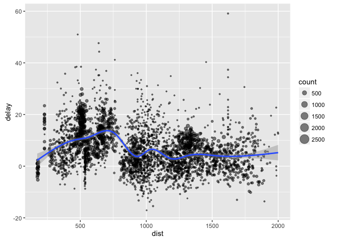

Spark Interface for R
================

[](https://travis-ci.com/rstudio/spark)

A set of tools to provision, connect and interface to Apache Spark from within the R language and ecosystem. This package supports connecting to local and remote Apache Spark clusters and provides support for R packages like dplyr and DBI.

Installation
------------

You can install the development version of the **spark** package using **devtools** as follows:

``` r
install.packages("devtools")
devtools::install_github("rstudio/spark")
```

You can then install various versions of Spark using the `spark_install` function:

``` r
library(spark)
spark_install(version = "1.6.0")
```

dplyr Interface
---------------

The spark package implements a dplyr back-end for Spark. Connect to Spark using the `spark_connect` function then obtain a dplyr interface using `src_spark` function:

``` r
# connect to local spark instance and get a dplyr interface
library(spark)
library(dplyr)
sc <- spark_connect("local")
db <- src_spark(sc)

# copy the flights table from the nycflights13 package to Spark
copy_to(db, nycflights13::flights, "flights")

# copy the Batting table from the Lahman package to Spark
copy_to(db, Lahman::Batting, "batting")
```

Then you can run dplyr against Spark:

``` r
# filter by departure delay and print the first few records
tbl(db, "flights") %>% filter(dep_delay == 2) %>% head
```

    ## Source: local data frame [6 x 16]
    ## 
    ##    year month   day dep_time dep_delay arr_time arr_delay carrier tailnum
    ## * <int> <int> <int>    <int>     <dbl>    <int>     <dbl>   <chr>   <chr>
    ## 1  2013     1     1      517         2      830        11      UA  N14228
    ## 2  2013     1     1      542         2      923        33      AA  N619AA
    ## 3  2013     1     1      702         2     1058        44      B6  N779JB
    ## 4  2013     1     1      715         2      911        21      UA  N841UA
    ## 5  2013     1     1      752         2     1025        -4      UA  N511UA
    ## 6  2013     1     1      917         2     1206        -5      B6  N568JB
    ## Variables not shown: flight <int>, origin <chr>, dest <chr>, air_time
    ##   <dbl>, distance <dbl>, hour <dbl>, minute <dbl>.

[Introduction to dplyr](https://cran.rstudio.com/web/packages/dplyr/vignettes/introduction.html) provides additional dplyr examples you can try. For example, consider the last example from the tutorial which plots data on flight delays:

``` r
# summarize delays for plotting
delay <- tbl(db, "flights") %>% 
          group_by(tailnum) %>%
          summarise(count = n(), dist = mean(distance), delay = mean(arr_delay)) %>%
          filter(count > 20, dist < 2000) %>%
          collect
    
# plot delays
library(ggplot2)
ggplot(delay, aes(dist, delay)) +
  geom_point(aes(size = count), alpha = 1/2) +
  geom_smooth() +
  scale_size_area()
```



### Window Functions

dplyr [window functions](https://cran.r-project.org/web/packages/dplyr/vignettes/window-functions.html) are also supported, for example:

``` r
# select and display 
select(tbl(db, "batting"), playerID, yearID, teamID, G, AB:H) %>%
  arrange(playerID, yearID, teamID) %>%
  group_by(playerID) %>%
  filter(min_rank(desc(H)) <= 2 & H > 0) %>%
  head
```

    ## Source: local data frame [6 x 7]
    ## Groups: playerID [3]
    ## 
    ##    playerID yearID teamID     G    AB     R     H
    ## *     <chr>  <int>  <chr> <int> <int> <int> <int>
    ## 1 anderal01   1941    PIT    70   223    32    48
    ## 2 anderal01   1942    PIT    54   166    24    45
    ## 3 balesco01   2008    WAS    15    15     1     3
    ## 4 balesco01   2009    WAS     7     8     0     1
    ## 5 bandoch01   1986    CLE    92   254    28    68
    ## 6 bandoch01   1984    CLE    75   220    38    64

EC2
---

To start a new 1-master 1-slave Spark cluster in EC2 run the following code:

``` r
library(spark)
master <- start_ec2(access_key_id = "AAAAAAAAAAAAAAAAAAAA",
                    secret_access_key = "1a1a1a1a1a1a1a1a1a1a1a1a1a1a1a1a1a1a1a1",
                    pem_file = "sparkster.pem")
          
sc <- spark_connect(master)
```

The `access_key_id`, `secret_access_key` and `pem_file` need to be retrieved from the AWS console.

Extensibility
-------------

Spark provides low level access to native JVM objects, this topic targets users creating packages based on low-level spark integration. Here's an example of an R `count_lines` function built by calling Spark functions for reading and counting the lines of a text file.

``` r
library(magrittr)

# define an R interface to Spark line counting
count_lines <- function(scon, path) {
  spark_context(scon) %>%
    spark_invoke("textFile", path) %>%
    spark_invoke("count")
}

# write a CSV 
tempfile <- tempfile(fileext = ".csv")
write.csv(nycflights13::flights, tempfile, row.names = FALSE, na = "")

# call spark to count the lines
count_lines(sc, tempfile)
```

    ## [1] 336777

Package authors can use this mechanism to create an R interface to any of Spark's underlying Java APIs.

dplyr Utilities
---------------

You can cache a table into memory with:

``` r
tbl_cache(db, "batting")
```

and unload from memory using:

``` r
tbl_uncache(db, "batting")
```

Connection Utilities
--------------------

You can view the Spark web console using the `spark_web` function:

``` r
spark_web(sc)
```

You can show the log using the `spark_log` function:

``` r
spark_log(sc, n = 10)
```

    ## 16/05/13 17:16:52 INFO TaskSchedulerImpl: Adding task set 19.0 with 1 tasks
    ## 16/05/13 17:16:52 INFO TaskSetManager: Starting task 0.0 in stage 19.0 (TID 415, localhost, partition 0,PROCESS_LOCAL, 2425 bytes)
    ## 16/05/13 17:16:52 INFO Executor: Running task 0.0 in stage 19.0 (TID 415)
    ## 16/05/13 17:16:52 INFO HadoopRDD: Input split: file:/var/folders/fz/v6wfsg2x1fb1rw4f6r0x4jwm0000gn/T/RtmpPOZDPP/file605a239328cd.csv:0+23367180
    ## 16/05/13 17:16:52 INFO BlockManagerInfo: Removed broadcast_21_piece0 on localhost:62717 in memory (size: 7.9 KB, free: 487.0 MB)
    ## 16/05/13 17:16:52 INFO Executor: Finished task 0.0 in stage 19.0 (TID 415). 2082 bytes result sent to driver
    ## 16/05/13 17:16:52 INFO TaskSetManager: Finished task 0.0 in stage 19.0 (TID 415) in 94 ms on localhost (1/1)
    ## 16/05/13 17:16:52 INFO TaskSchedulerImpl: Removed TaskSet 19.0, whose tasks have all completed, from pool 
    ## 16/05/13 17:16:52 INFO DAGScheduler: ResultStage 19 (count at NativeMethodAccessorImpl.java:-2) finished in 0.095 s
    ## 16/05/13 17:16:52 INFO DAGScheduler: Job 11 finished: count at NativeMethodAccessorImpl.java:-2, took 0.097819 s

Finally, we disconnect from Spark:

``` r
spark_disconnect(sc)
```
