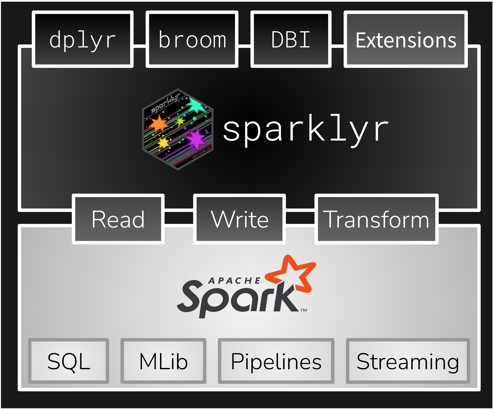
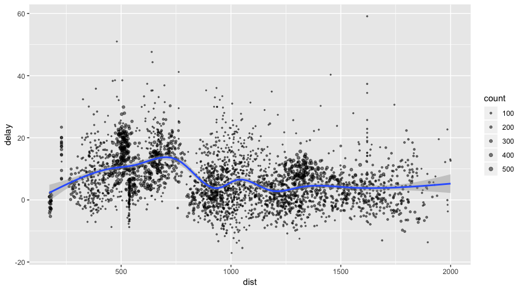

sparklyr: R interface for Apache Spark
================

<!-- README.md is generated from README.Rmd. Please edit that file -->

<!-- badges: start -->

[](https://github.com/sparklyr/sparklyr/actions/workflows/R-CMD-check.yaml)
[](https://github.com/sparklyr/sparklyr/actions/workflows/spark-tests.yaml)
[](https://CRAN.R-project.org/package=sparklyr)
[](https://app.codecov.io/gh/sparklyr/sparklyr?branch=main)
<!-- badges: end -->



- Install and connect to [Spark](https://spark.apache.org/) using YARN,
  Mesos, Livy or Kubernetes.
- Use [dplyr](#using-dplyr) to filter and aggregate Spark datasets and
  [streams](https://spark.posit.co/guides/streaming/) then bring them
  into R for analysis and visualization.
- Create interoperable machine learning
  [pipelines](https://spark.posit.co/guides/pipelines.html)
- Create [extensions](#extensions) that call the full Spark API or run
  [distributed R](#distributed-r) code to support new functionality.

## Table of Contents

- [Installation](#installation)
- [Connecting to Spark](#connecting-to-spark)
- [Using dplyr](#using-dplyr)
  - [Window Functions](#window-functions)
- [Using SQL](#using-sql)
- [Machine Learning](#machine-learning)
- [Reading and Writing Data](#reading-and-writing-data)
- [Distributed R](#distributed-r)
- [Extensions](#extensions)
- [Table Utilities](#table-utilities)
- [Connection Utilities](#connection-utilities)
- [RStudio IDE](#rstudio-ide)
- [Using H2O](#using-h2o)
- [Connecting through Livy](#connecting-through-livy)
- [Connecting through Databricks
  Connect](#connecting-through-databricks-connect-v2)

## Installation

You can install the **sparklyr** package from
[CRAN](https://CRAN.r-project.org) as follows:

``` r
install.packages("sparklyr")
```

You should also install a local version of Spark for development
purposes:

``` r
library(sparklyr)
spark_install()
```

To upgrade to the latest version of sparklyr, run the following command
and restart your r session:

``` r
install.packages("devtools")
devtools::install_github("sparklyr/sparklyr")
```

## Connecting to Spark

You can connect to both local instances of Spark as well as remote Spark
clusters. Here we’ll connect to a local instance of Spark via the
[spark_connect](https://spark.posit.co/packages/sparklyr/latest/reference/spark-connections.html)
function:

``` r
library(sparklyr)
sc <- spark_connect(master = "local")
```

The returned Spark connection (`sc`) provides a remote dplyr data source
to the Spark cluster.

For more information on connecting to remote Spark clusters see the
[Deployment](https://spark.posit.co/deployment.html) section of the
sparklyr website.

## Using dplyr

We can now use all of the available dplyr verbs against the tables
within the cluster.

We’ll start by copying some datasets from R into the Spark cluster (note
that you may need to install the nycflights13 and Lahman packages in
order to execute this code):

``` r
install.packages(c("nycflights13", "Lahman"))
```

``` r
library(dplyr)
iris_tbl <- copy_to(sc, iris, overwrite = TRUE)
flights_tbl <- copy_to(sc, nycflights13::flights, "flights", overwrite = TRUE)
batting_tbl <- copy_to(sc, Lahman::Batting, "batting", overwrite = TRUE)
src_tbls(sc)
#> [1] "batting" "flights" "iris"
```

To start with here’s a simple filtering example:

``` r
# filter by departure delay and print the first few records
flights_tbl %>% filter(dep_delay == 2)
#> # Source:   SQL [?? x 19]
#> # Database: spark_connection
#>     year month   day dep_time sched_dep_time dep_delay
#>    <int> <int> <int>    <int>          <int>     <dbl>
#>  1  2013     1     1      517            515         2
#>  2  2013     1     1      542            540         2
#>  3  2013     1     1      702            700         2
#>  4  2013     1     1      715            713         2
#>  5  2013     1     1      752            750         2
#>  6  2013     1     1      917            915         2
#>  7  2013     1     1      932            930         2
#>  8  2013     1     1     1028           1026         2
#>  9  2013     1     1     1042           1040         2
#> 10  2013     1     1     1231           1229         2
#> # ℹ more rows
#> # ℹ 13 more variables: arr_time <int>,
#> #   sched_arr_time <int>, arr_delay <dbl>, carrier <chr>,
#> #   flight <int>, tailnum <chr>, origin <chr>, dest <chr>,
#> #   air_time <dbl>, distance <dbl>, hour <dbl>,
#> #   minute <dbl>, time_hour <dttm>
```

[Introduction to dplyr](https://spark.posit.co/guides/dplyr.html)
provides additional `dplyr` examples you can try. For example, consider
the last example from the tutorial which plots data on flight delays:

``` r
delay <- flights_tbl %>%
  group_by(tailnum) %>%
  summarise(count = n(), dist = mean(distance), delay = mean(arr_delay)) %>%
  filter(count > 20, dist < 2000, !is.na(delay)) %>%
  collect()

# plot delays
library(ggplot2)
ggplot(delay, aes(dist, delay)) +
  geom_point(aes(size = count), alpha = 1/2) +
  geom_smooth() +
  scale_size_area(max_size = 2)
#> `geom_smooth()` using method = 'gam' and formula = 'y ~
#> s(x, bs = "cs")'
```



### Window Functions

dplyr [window
functions](https://spark.posit.co/guides/dplyr.html#grouping) are also
supported, for example:

``` r
batting_tbl %>%
  select(playerID, yearID, teamID, G, AB:H) %>%
  arrange(playerID, yearID, teamID) %>%
  group_by(playerID) %>%
  filter(min_rank(desc(H)) <= 2 & H > 0)
#> # Source:     SQL [?? x 7]
#> # Database:   spark_connection
#> # Groups:     playerID
#> # Ordered by: playerID, yearID, teamID
#>    playerID  yearID teamID     G    AB     R     H
#>    <chr>      <int> <chr>  <int> <int> <int> <int>
#>  1 abadijo01   1875 PH3       11    45     3    10
#>  2 abadijo01   1875 BR2        1     4     1     1
#>  3 abbeybe01   1896 BRO       25    63     7    12
#>  4 abbeybe01   1892 WAS       27    75     5     9
#>  5 abbeych01   1894 WAS      129   523    95   164
#>  6 abbeych01   1895 WAS      133   516   102   142
#>  7 abbotfr01   1903 CLE       77   255    25    60
#>  8 abbotfr01   1905 PHI       42   128     9    25
#>  9 abbotky01   1992 PHI       31    29     1     2
#> 10 abbotky01   1995 PHI       18     2     1     1
#> # ℹ more rows
```

For additional documentation on using dplyr with Spark see the
[dplyr](https://spark.posit.co/dplyr.html) section of the sparklyr
website.

## Using SQL

It’s also possible to execute SQL queries directly against tables within
a Spark cluster. The `spark_connection` object implements a
[DBI](https://github.com/r-dbi/DBI) interface for Spark, so you can use
`dbGetQuery()` to execute SQL and return the result as an R data frame:

``` r
library(DBI)
iris_preview <- dbGetQuery(sc, "SELECT * FROM iris LIMIT 10")
iris_preview
#>    Sepal_Length Sepal_Width Petal_Length Petal_Width
#> 1           5.1         3.5          1.4         0.2
#> 2           4.9         3.0          1.4         0.2
#> 3           4.7         3.2          1.3         0.2
#> 4           4.6         3.1          1.5         0.2
#> 5           5.0         3.6          1.4         0.2
#> 6           5.4         3.9          1.7         0.4
#> 7           4.6         3.4          1.4         0.3
#> 8           5.0         3.4          1.5         0.2
#> 9           4.4         2.9          1.4         0.2
#> 10          4.9         3.1          1.5         0.1
#>    Species
#> 1   setosa
#> 2   setosa
#> 3   setosa
#> 4   setosa
#> 5   setosa
#> 6   setosa
#> 7   setosa
#> 8   setosa
#> 9   setosa
#> 10  setosa
```

## Machine Learning

You can orchestrate machine learning algorithms in a Spark cluster via
the [machine
learning](https://spark.apache.org/docs/latest/mllib-guide.html)
functions within **sparklyr**. These functions connect to a set of
high-level APIs built on top of DataFrames that help you create and tune
machine learning workflows.

Here’s an example where we use
[ml_linear_regression](https://spark.posit.co/packages/sparklyr/latest/reference/ml_linear_regression/)
to fit a linear regression model. We’ll use the built-in `mtcars`
dataset, and see if we can predict a car’s fuel consumption (`mpg`)
based on its weight (`wt`), and the number of cylinders the engine
contains (`cyl`). We’ll assume in each case that the relationship
between `mpg` and each of our features is linear.

``` r
# copy mtcars into spark
mtcars_tbl <- copy_to(sc, mtcars, overwrite = TRUE)

# transform our data set, and then partition into 'training', 'test'
partitions <- mtcars_tbl %>%
  filter(hp >= 100) %>%
  mutate(cyl8 = cyl == 8) %>%
  sdf_partition(training = 0.5, test = 0.5, seed = 1099)

# fit a linear model to the training dataset
fit <- partitions$training %>%
  ml_linear_regression(response = "mpg", features = c("wt", "cyl"))
fit
#> Formula: mpg ~ wt + cyl
#> 
#> Coefficients:
#> (Intercept)          wt         cyl 
#>  37.1464554  -4.3408005  -0.5830515
```

For linear regression models produced by Spark, we can use `summary()`
to learn a bit more about the quality of our fit, and the statistical
significance of each of our predictors.

``` r
summary(fit)
#> Deviance Residuals:
#>     Min      1Q  Median      3Q     Max 
#> -2.5134 -0.9158 -0.1683  1.1503  2.1534 
#> 
#> Coefficients:
#> (Intercept)          wt         cyl 
#>  37.1464554  -4.3408005  -0.5830515 
#> 
#> R-Squared: 0.9428
#> Root Mean Squared Error: 1.409
```

Spark machine learning supports a wide array of algorithms and feature
transformations and as illustrated above it’s easy to chain these
functions together with dplyr pipelines. To learn more see the [machine
learning](https://spark.posit.co/mlib/) section.

## Reading and Writing Data

You can read and write data in CSV, JSON, and Parquet formats. Data can
be stored in HDFS, S3, or on the local filesystem of cluster nodes.

``` r
temp_csv <- tempfile(fileext = ".csv")
temp_parquet <- tempfile(fileext = ".parquet")
temp_json <- tempfile(fileext = ".json")

spark_write_csv(iris_tbl, temp_csv)
iris_csv_tbl <- spark_read_csv(sc, "iris_csv", temp_csv)

spark_write_parquet(iris_tbl, temp_parquet)
iris_parquet_tbl <- spark_read_parquet(sc, "iris_parquet", temp_parquet)

spark_write_json(iris_tbl, temp_json)
iris_json_tbl <- spark_read_json(sc, "iris_json", temp_json)

src_tbls(sc)
#> [1] "batting"      "flights"      "iris"        
#> [4] "iris_csv"     "iris_json"    "iris_parquet"
#> [7] "mtcars"
```

## Distributed R

You can execute arbitrary r code across your cluster using
`spark_apply()`. For example, we can apply `rgamma` over `iris` as
follows:

``` r
spark_apply(iris_tbl, function(data) {
  data[1:4] + rgamma(1,2)
})
#> # Source:   table<`sparklyr_tmp__752f1c17_51c6_45bc_a22e_fa06e1ebac58`> [?? x 4]
#> # Database: spark_connection
#>    Sepal_Length Sepal_Width Petal_Length Petal_Width
#>           <dbl>       <dbl>        <dbl>       <dbl>
#>  1        10.1         8.48         6.38        5.18
#>  2         9.88        7.98         6.38        5.18
#>  3         9.68        8.18         6.28        5.18
#>  4         9.58        8.08         6.48        5.18
#>  5         9.98        8.58         6.38        5.18
#>  6        10.4         8.88         6.68        5.38
#>  7         9.58        8.38         6.38        5.28
#>  8         9.98        8.38         6.48        5.18
#>  9         9.38        7.88         6.38        5.18
#> 10         9.88        8.08         6.48        5.08
#> # ℹ more rows
```

You can also group by columns to perform an operation over each group of
rows and make use of any package within the closure:

``` r
spark_apply(
  iris_tbl,
  function(e) broom::tidy(lm(Petal_Width ~ Petal_Length, e)),
  columns = c("term", "estimate", "std.error", "statistic", "p.value"),
  group_by = "Species"
)
#> # Source:   table<`sparklyr_tmp__11d902f5_6218_41db_85dd_72c5ebe98eab`> [?? x 6]
#> # Database: spark_connection
#>   Species    term      estimate std.error statistic  p.value
#>   <chr>      <chr>        <dbl>     <dbl>     <dbl>    <dbl>
#> 1 versicolor (Interce…  -0.0843    0.161     -0.525 6.02e- 1
#> 2 versicolor Petal_Le…   0.331     0.0375     8.83  1.27e-11
#> 3 virginica  (Interce…   1.14      0.379      2.99  4.34e- 3
#> 4 virginica  Petal_Le…   0.160     0.0680     2.36  2.25e- 2
#> 5 setosa     (Interce…  -0.0482    0.122     -0.396 6.94e- 1
#> 6 setosa     Petal_Le…   0.201     0.0826     2.44  1.86e- 2
```

## Extensions

The facilities used internally by sparklyr for its `dplyr` and machine
learning interfaces are available to extension packages. Since Spark is
a general purpose cluster computing system there are many potential
applications for extensions (e.g.  interfaces to custom machine learning
pipelines, interfaces to 3rd party Spark packages, etc.).

Here’s a simple example that wraps a Spark text file line counting
function with an R function:

``` r
# write a CSV
tempfile <- tempfile(fileext = ".csv")
write.csv(nycflights13::flights, tempfile, row.names = FALSE, na = "")

# define an R interface to Spark line counting
count_lines <- function(sc, path) {
  spark_context(sc) %>%
    invoke("textFile", path, 1L) %>%
      invoke("count")
}

# call spark to count the lines of the CSV
count_lines(sc, tempfile)
#> [1] 336777
```

To learn more about creating extensions see the
[Extensions](https://spark.posit.co/guides/extensions.html) section of
the sparklyr website.

## Table Utilities

You can cache a table into memory with:

``` r
tbl_cache(sc, "batting")
```

and unload from memory using:

``` r
tbl_uncache(sc, "batting")
```

## Connection Utilities

You can view the Spark web console using the `spark_web()` function:

``` r
spark_web(sc)
```

You can show the log using the `spark_log()` function:

``` r
spark_log(sc, n = 10)
#> {"ts":"2025-03-18T05:33:03.487Z","level":"INFO","msg":"Running task 0.0 in stage 90.0 (TID 127)","context":{"task_name":"task 0.0 in stage 90.0 (TID 127)"},"logger":"Executor"}
#> {"ts":"2025-03-18T05:33:03.491Z","level":"INFO","msg":"Task (TID 127) input split: file:/var/folders/y_/f_0cx_291nl0s8h26t4jg6ch0000gp/T/RtmpTDeQSI/fileaff16a4bc7cf.csv:0+33313106","context":{"input_split":"file:/var/folders/y_/f_0cx_291nl0s8h26t4jg6ch0000gp/T/RtmpTDeQSI/fileaff16a4bc7cf.csv:0+33313106","task_id":"127","task_name":"task 0.0 in stage 90.0 (TID 127)"},"logger":"HadoopRDD"}
#> {"ts":"2025-03-18T05:33:03.597Z","level":"INFO","msg":"Finished task 0.0 in stage 90.0 (TID 127). 1078 bytes result sent to driver","context":{"num_bytes":"1078","task_name":"task 0.0 in stage 90.0 (TID 127)"},"logger":"Executor"}
#> {"ts":"2025-03-18T05:33:03.598Z","level":"INFO","msg":"Finished task 0.0 in stage 90.0 (TID 127) in 116 ms on localhost (executor driver) (1/1)","context":{"duration":"116","executor_id":"driver","host":"localhost","num_successful_tasks":"1","num_tasks":"1","task_name":"task 0.0 in stage 90.0 (TID 127)"},"logger":"TaskSetManager"}
#> {"ts":"2025-03-18T05:33:03.598Z","level":"INFO","msg":"Removed TaskSet 90.0 whose tasks have all completed, from pool ","context":{"pool_name":"","stage_attempt":"0","stage_id":"90"},"logger":"TaskSchedulerImpl"}
#> {"ts":"2025-03-18T05:33:03.598Z","level":"INFO","msg":"ResultStage 90 (count at NativeMethodAccessorImpl.java:0) finished in 118 ms","context":{"stage":"ResultStage 90","stage_name":"count at NativeMethodAccessorImpl.java:0","time_units":"118"},"logger":"DAGScheduler"}
#> {"ts":"2025-03-18T05:33:03.598Z","level":"INFO","msg":"Job 74 is finished. Cancelling potential speculative or zombie tasks for this job","context":{"job_id":"74"},"logger":"DAGScheduler"}
#> {"ts":"2025-03-18T05:33:03.598Z","level":"INFO","msg":"Canceling stage 90","context":{"stage_id":"90"},"logger":"TaskSchedulerImpl"}
#> {"ts":"2025-03-18T05:33:03.598Z","level":"INFO","msg":"Killing all running tasks in stage 90: Stage finished","context":{"reason":"Stage finished","stage_id":"90"},"logger":"TaskSchedulerImpl"}
#> {"ts":"2025-03-18T05:33:03.598Z","level":"INFO","msg":"Job 74 finished: count at NativeMethodAccessorImpl.java:0, took 118.374959 ms","context":{"call_site_short_form":"count at NativeMethodAccessorImpl.java:0","job_id":"74","time":"118.374959"},"logger":"DAGScheduler"}
```

Finally, we disconnect from Spark:

``` r
  spark_disconnect(sc)
```

## RStudio IDE

The RStudio IDE includes integrated support for Spark and the sparklyr
package, including tools for:

- Creating and managing Spark connections
- Browsing the tables and columns of Spark DataFrames
- Previewing the first 1,000 rows of Spark DataFrames

Once you’ve installed the sparklyr package, you should find a new
**Spark** pane within the IDE. This pane includes a **New Connection**
dialog which can be used to make connections to local or remote Spark
instances:


Once you’ve connected to Spark you’ll be able to browse the tables
contained within the Spark cluster and preview Spark DataFrames using
the standard RStudio data viewer:


You can also connect to Spark through [Livy](https://livy.apache.org/)
through a new connection dialog:


<div style="margin-bottom: 15px;">

</div>

## Using H2O

[rsparkling](https://cran.r-project.org/package=rsparkling) is a CRAN
package from [H2O](https://h2o.ai/) that extends
[sparklyr](https://spark.posit.co/) to provide an interface into
[Sparkling Water](https://github.com/h2oai/sparkling-water). For
instance, the following example installs, configures and runs
[h2o.glm](https://docs.h2o.ai/h2o/latest-stable/h2o-docs/data-science/glm.html):

``` r
library(rsparkling)
library(sparklyr)
library(dplyr)
library(h2o)

sc <- spark_connect(master = "local", version = "2.3.2")
mtcars_tbl <- copy_to(sc, mtcars, "mtcars", overwrite = TRUE)

mtcars_h2o <- as_h2o_frame(sc, mtcars_tbl, strict_version_check = FALSE)

mtcars_glm <- h2o.glm(x = c("wt", "cyl"),
                      y = "mpg",
                      training_frame = mtcars_h2o,
                      lambda_search = TRUE)
```

``` r
mtcars_glm
```

    #> Model Details:
    #> ==============
    #>
    #> H2ORegressionModel: glm
    #> Model ID:  GLM_model_R_1527265202599_1
    #> GLM Model: summary
    #>     family     link                              regularization
    #> 1 gaussian identity Elastic Net (alpha = 0.5, lambda = 0.1013 )
    #>                                                                lambda_search
    #> 1 nlambda = 100, lambda.max = 10.132, lambda.min = 0.1013, lambda.1se = -1.0
    #>   number_of_predictors_total number_of_active_predictors
    #> 1                          2                           2
    #>   number_of_iterations                                training_frame
    #> 1                  100 frame_rdd_31_ad5c4e88ec97eb8ccedae9475ad34e02
    #>
    #> Coefficients: glm coefficients
    #>       names coefficients standardized_coefficients
    #> 1 Intercept    38.941654                 20.090625
    #> 2       cyl    -1.468783                 -2.623132
    #> 3        wt    -3.034558                 -2.969186
    #>
    #> H2ORegressionMetrics: glm
    #> ** Reported on training data. **
    #>
    #> MSE:  6.017684
    #> RMSE:  2.453097
    #> MAE:  1.940985
    #> RMSLE:  0.1114801
    #> Mean Residual Deviance :  6.017684
    #> R^2 :  0.8289895
    #> Null Deviance :1126.047
    #> Null D.o.F. :31
    #> Residual Deviance :192.5659
    #> Residual D.o.F. :29
    #> AIC :156.2425

``` r
spark_disconnect(sc)
```

## Connecting through Livy

[Livy](https://github.com/cloudera/livy) enables remote connections to
Apache Spark clusters. However, please notice that connecting to Spark
clusters through Livy is much slower than any other connection method.

Before connecting to Livy, you will need the connection information to
an existing service running Livy. Otherwise, to test `livy` in your
local environment, you can install it and run it locally as follows:

``` r
livy_install()
```

``` r
livy_service_start()
```

To connect, use the Livy service address as `master` and
`method = "livy"` in `spark_connect()`. Once connection completes, use
`sparklyr` as usual, for instance:

``` r
sc <- spark_connect(master = "http://localhost:8998", method = "livy", version = "3.0.0")
copy_to(sc, iris, overwrite = TRUE)

spark_disconnect(sc)
```

Once you are done using `livy` locally, you should stop this service
with:

``` r
livy_service_stop()
```

To connect to remote `livy` clusters that support basic authentication
connect as:

``` r
config <- livy_config(username="<username>", password="<password>")
sc <- spark_connect(master = "<address>", method = "livy", config = config)
spark_disconnect(sc)
```

## Connecting through Databricks Connect v2

`sparklyr` is able to interact with [Databricks Connect
v2](https://docs.databricks.com/en/dev-tools/databricks-connect/index.html)
via a new extension called `pysparklyr`. To learn how to use, and the
latest updates on this integration see [the article in `sparklyr`’s
official
website](https://spark.posit.co/deployment/databricks-connect.html).
