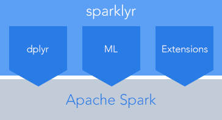
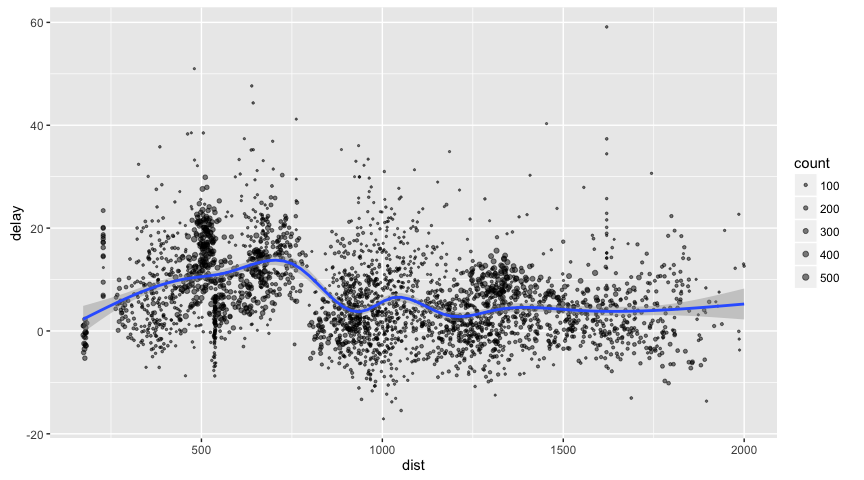

sparklyr: R interface for Apache Spark
================

[](https://travis-ci.org/rstudio/sparklyr)



-   Connect to [Spark](http://spark.apache.org/) from R. The sparklyr package provides a <br/> complete [dplyr](https://github.com/hadley/dplyr) backend.
-   Filter and aggregate Spark datasets then bring them into R for analysis and visualization.
-   Use Spark's distributed [machine learning](http://spark.apache.org/docs/latest/mllib-guide.html) library from R.
-   Create [extensions](http://spark.rstudio.com/extensions.html) that call the full Spark API and provide <br/> interfaces to Spark packages.

Installation
------------

You can install the development version of the **sparklyr** package using [**devtools**](https://cran.r-project.org/web/packages/devtools/index.html) as follows:

``` r
install.packages("devtools")
devtools::install_github("rstudio/sparklyr")
```

You should also install a local version of Spark for development purposes:

``` r
library(sparklyr)
spark_install(version = "1.6.2")
```

If you use the RStudio IDE, you should also download the latest [preview release](https://www.rstudio.com/products/rstudio/download/preview/) of the IDE which includes several enhancements for interacting with Spark (see the [RStudio IDE](#rstudio-ide) section below for more details).

Connecting to Spark
-------------------

You can connect to both local instances of Spark as well as remote Spark clusters. Here we'll connect to a local instance of Spark via the [spark\_connect](http://spark.rstudio.com/reference/sparklyr/latest/spark_connect.html) function:

``` r
library(sparklyr)
library(dplyr)
sc <- spark_connect(master = "local")
```

The returned Spark connection (`sc`) provides a remote dplyr data source to the Spark cluster.

For more information on connecting to remote Spark clusters see the [Deployment](http://spark.rstudio.com/deployment.html) section.of the sparklyr website.

Using dplyr
-----------

We can new use all of the available dplyr verbs against the tables within the cluster.

We'll start by copying some datasets from R into the Spark cluster (note that you may need to install the nycflights13 and Lahman packages in order to execute this code):

``` r
install.packages("Lahman")
install.packages("nycflights13")
```

``` r
iris_tbl <- copy_to(sc, iris)
flights_tbl <- copy_to(sc, nycflights13::flights, "flights")
batting_tbl <- copy_to(sc, Lahman::Batting, "batting")
src_tbls(sc)
```

    ## [1] "batting" "flights" "iris"

To start with here's a simple filtering example:

``` r
# filter by departure delay and print the first few records
flights_tbl %>% filter(dep_delay == 2)
```

    ## Source:   query [?? x 16]
    ## Database: spark connection master=local[8] app=sparklyr local=TRUE
    ## 
    ##     year month   day dep_time dep_delay arr_time arr_delay carrier tailnum
    ##    <int> <int> <int>    <int>     <dbl>    <int>     <dbl>   <chr>   <chr>
    ## 1   2013     1     1      517         2      830        11      UA  N14228
    ## 2   2013     1     1      542         2      923        33      AA  N619AA
    ## 3   2013     1     1      702         2     1058        44      B6  N779JB
    ## 4   2013     1     1      715         2      911        21      UA  N841UA
    ## 5   2013     1     1      752         2     1025        -4      UA  N511UA
    ## 6   2013     1     1      917         2     1206        -5      B6  N568JB
    ## 7   2013     1     1      932         2     1219        -6      VX  N641VA
    ## 8   2013     1     1     1028         2     1350        11      UA  N76508
    ## 9   2013     1     1     1042         2     1325        -1      B6  N529JB
    ## 10  2013     1     1     1231         2     1523        -6      UA  N402UA
    ## # ... with more rows, and 7 more variables: flight <int>, origin <chr>,
    ## #   dest <chr>, air_time <dbl>, distance <dbl>, hour <dbl>, minute <dbl>

[Introduction to dplyr](https://cran.rstudio.com/web/packages/dplyr/vignettes/introduction.html) provides additional dplyr examples you can try. For example, consider the last example from the tutorial which plots data on flight delays:

``` r
delay <- flights_tbl %>% 
  group_by(tailnum) %>%
  summarise(count = n(), dist = mean(distance), delay = mean(arr_delay)) %>%
  filter(count > 20, dist < 2000, !is.na(delay)) %>%
  collect

# plot delays
library(ggplot2)
ggplot(delay, aes(dist, delay)) +
  geom_point(aes(size = count), alpha = 1/2) +
  geom_smooth() +
  scale_size_area(max_size = 2)
```



### Window Functions

dplyr [window functions](https://cran.r-project.org/web/packages/dplyr/vignettes/window-functions.html) are also supported, for example:

``` r
batting_tbl %>%
  select(playerID, yearID, teamID, G, AB:H) %>%
  arrange(playerID, yearID, teamID) %>%
  group_by(playerID) %>%
  filter(min_rank(desc(H)) <= 2 & H > 0)
```

    ## Source:   query [?? x 7]
    ## Database: spark connection master=local[8] app=sparklyr local=TRUE
    ## Groups: playerID
    ## 
    ##     playerID yearID teamID     G    AB     R     H
    ##        <chr>  <int>  <chr> <int> <int> <int> <int>
    ## 1  adamsac01   1943    NY1    70    32     3     4
    ## 2  adamsac01   1944    NY1    65    29     2     3
    ## 3  adamsac01   1945    NY1    65    16     2     3
    ## 4  allisdo01   1874    NY2    65   318    68    90
    ## 5  allisdo01   1875    HR1    61   269    38    67
    ## 6  ayraujo01   1996    ATL     7     5     0     1
    ## 7  backebr01   2008    HOU    32    47     8    13
    ## 8  backebr01   2005    HOU    28    45     5    10
    ## 9  bakerfr02   1969    CLE    52   172    21    44
    ## 10 bakerfr02   1971    CLE    73   181    18    38
    ## # ... with more rows

For additional documentation on using dplyr with Spark see the [dplyr](http://spark.rstudio.com/dplyr.html) section of the sparklyr website.

Machine Learning
----------------

You can orchestrate machine learning algorithms in a Spark cluster via the [machine learning](http://spark.apache.org/docs/latest/mllib-guide.html) functions within **sparklyr**. These functions connect to a set of high-level APIs built on top of DataFrames that help you create and tune machine learning workflows.

Here's an example where we use [ml\_linear\_regression](http://spark.rstudio.com/reference/sparklyr/latest/ml_linear_regression.html) to fit a linear regression model. We'll use the built-in `mtcars` dataset, and see if we can predict a car's fuel consumption (`mpg`) based on its weight (`wt`), and the number of cylinders the engine contains (`cyl`). We'll assume in each case that the relationship between `mpg` and each of our features is linear.

``` r
# copy mtcars into spark
mtcars_tbl <- copy_to(sc, mtcars)

# transform our data set, and then partition into 'training', 'test'
partitions <- mtcars_tbl %>%
  filter(hp >= 100) %>%
  mutate(cyl8 = cyl == 8) %>%
  sdf_partition(training = 0.5, test = 0.5, seed = 1099)

# fit a linear model to the training dataset
fit <- partitions$training %>%
  ml_linear_regression(response = "mpg", features = c("wt", "cyl"))
fit
```

    ## Call:
    ## mpg ~ wt + cyl
    ## 
    ## Coefficients:
    ## (Intercept)          wt         cyl 
    ##   33.499452   -2.818463   -0.923187

For linear regression models produced by Spark, we can use `summary()` to learn a bit more about the quality of our fit, and the statistical significance of each of our predictors.

``` r
summary(fit)
```

    ## Call:
    ## mpg ~ wt + cyl
    ## 
    ## Residuals:
    ##    Min     1Q Median     3Q    Max 
    ## -1.752 -1.134 -0.499  1.296  2.282 
    ## 
    ## Coefficients:
    ##             Estimate Std. Error t value  Pr(>|t|)    
    ## (Intercept) 33.49945    3.62256  9.2475 0.0002485 ***
    ## wt          -2.81846    0.96619 -2.9171 0.0331257 *  
    ## cyl         -0.92319    0.54639 -1.6896 0.1518998    
    ## ---
    ## Signif. codes:  0 '***' 0.001 '**' 0.01 '*' 0.05 '.' 0.1 ' ' 1
    ## 
    ## R-Squared: 0.8274
    ## Root Mean Squared Error: 1.422

Spark machine learning supports a wide array of algorithms and feature transformations and as illustrated above it's easy to chain these functions together with dplyr pipelines. To learn more see the [machine learning](mllib.html) section.

Reading and Writing Data
------------------------

You can read and write data in CSV, JSON, and Parquet formats. Data can be stored in HDFS, S3, or on the lcoal filesystem of cluster nodes.

``` r
temp_csv <- tempfile(fileext = ".csv")
temp_parquet <- tempfile(fileext = ".parquet")
temp_json <- tempfile(fileext = ".json")

spark_write_csv(iris_tbl, temp_csv)
iris_csv_tbl <- spark_read_csv(sc, "iris_csv", temp_csv)

spark_write_parquet(iris_tbl, temp_parquet)
iris_parquet_tbl <- spark_read_parquet(sc, "iris_parquet", temp_parquet)

spark_write_csv(iris_tbl, temp_json)
iris_json_tbl <- spark_read_csv(sc, "iris_json", temp_json)

src_tbls(sc)
```

    ## [1] "batting"      "flights"      "iris"         "iris_csv"    
    ## [5] "iris_json"    "iris_parquet" "mtcars"

Extensions
----------

The facilities used internally by sparklyr for its dplyr and machine learning interfaces are available to extension packages via the [sparkapi](https://github.com/rstudio/sparkapi) package. Since Spark is a general purpose cluster computing system there are many potential applications for extensions (e.g. interfaces to custom machine learning pipelines, interfaces to 3rd party Spark packages, etc.).

Here's a simple example that wraps a Spark text file line counting function with an R function:

``` r
library(sparkapi)

# write a CSV 
tempfile <- tempfile(fileext = ".csv")
write.csv(nycflights13::flights, tempfile, row.names = FALSE, na = "")

# define an R interface to Spark line counting
count_lines <- function(sc, path) {
  spark_context(sc) %>% 
    invoke("textFile", path, 1L) %>% 
      invoke("count")
}

# call spark to count the lines of the CSV
count_lines(sc, tempfile)
```

    ## [1] 336777

To learn more about creating extensions see the [Extensions](http://spark.rstudio.com/extensions.html) section of the sparklyr website.

dplyr Utilities
---------------

You can cache a table into memory with:

``` r
tbl_cache(sc, "batting")
```

and unload from memory using:

``` r
tbl_uncache(sc, "batting")
```

Connection Utilities
--------------------

You can view the Spark web console using the `spark_web` function:

``` r
spark_web(sc)
```

You can show the log using the `spark_log` function:

``` r
spark_log(sc, n = 10)
```

    ## [Stage 21:==================================================>   (186 + 8) / 200]
    ##                                                                                 
    ## 16/07/07 10:02:20 WARN WeightedLeastSquares: regParam is zero, which might cause numerical instability and overfitting.
    ## 16/07/07 10:02:20 WARN BLAS: Failed to load implementation from: com.github.fommil.netlib.NativeSystemBLAS
    ## 16/07/07 10:02:20 WARN BLAS: Failed to load implementation from: com.github.fommil.netlib.NativeRefBLAS
    ## 16/07/07 10:02:20 WARN LAPACK: Failed to load implementation from: com.github.fommil.netlib.NativeSystemLAPACK
    ## 16/07/07 10:02:20 WARN LAPACK: Failed to load implementation from: com.github.fommil.netlib.NativeRefLAPACK
    ## SLF4J: Failed to load class "org.slf4j.impl.StaticLoggerBinder".
    ## SLF4J: Defaulting to no-operation (NOP) logger implementation
    ## SLF4J: See http://www.slf4j.org/codes.html#StaticLoggerBinder for further details.

Finally, we disconnect from Spark:

``` r
spark_disconnect(sc)
```

RStudio IDE
-----------

The latest RStudio [Preview Release](https://www.rstudio.com/products/rstudio/download/preview/) of the RStudio IDE includes integrated support for Spark and the sparklyr package, including tools for:

-   Creating and managing Spark connections
-   Browsing the tables and columns of Spark DataFrames
-   Previewing the first 1,000 rows of Spark DataFrames

Once you've installed the sparklyr package, you should find a new **Spark** pane within the IDE. This pane includes a **New Connection** dialog which can be used to make connections to local or remote Spark instances:


Once you've connected to Spark you'll be able to browse the tables contained within the Spark cluster:


The Spark DataFrame preview uses the standard RStudio data viewer:


The RStudio IDE features for sparklyr are available now as part of the [RStudio Preview Release](https://www.rstudio.com/products/rstudio/download/preview/).
