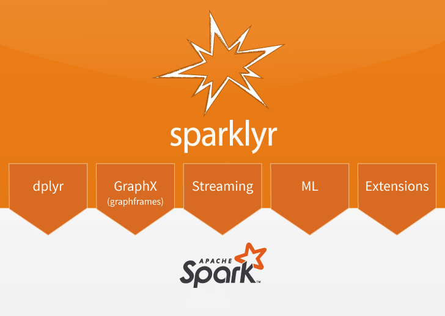
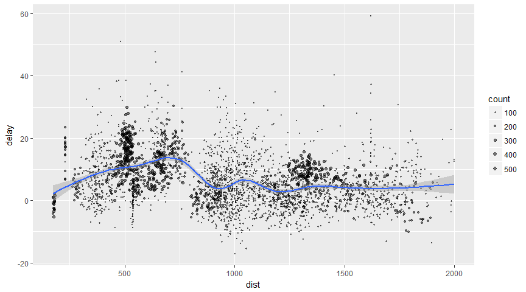
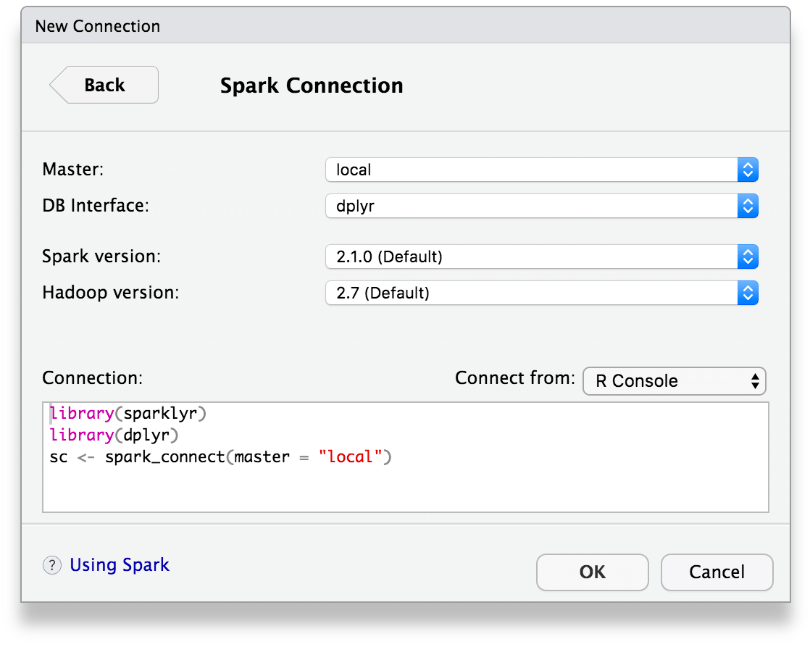
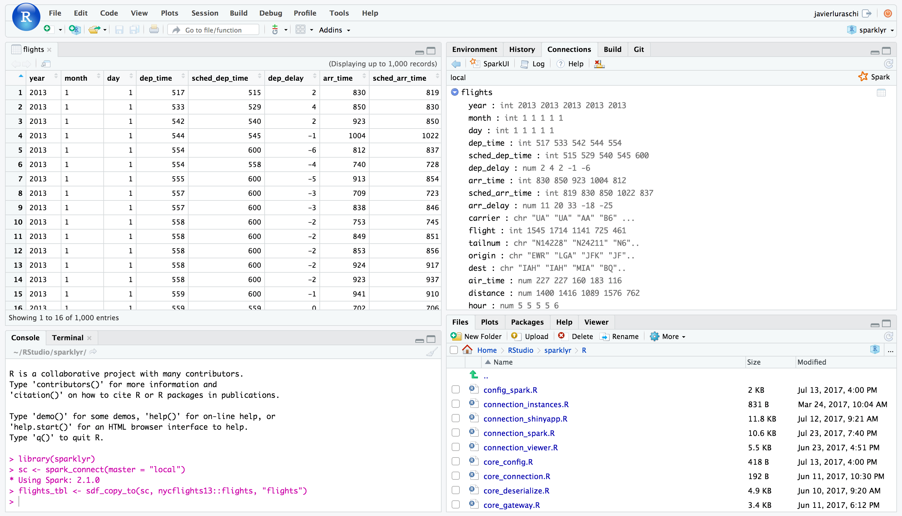
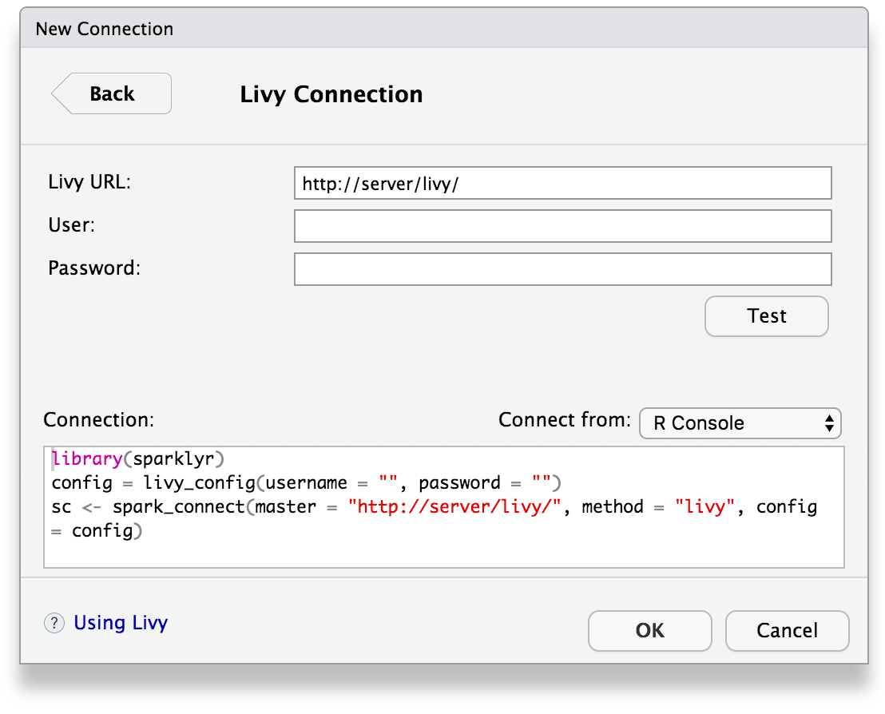

sparklyr: R interface for Apache Spark
================

[](https://travis-ci.org/rstudio/sparklyr) [](https://cran.r-project.org/package=sparklyr) [](https://codecov.io/gh/rstudio/sparklyr) [](https://gitter.im/rstudio/sparklyr?utm_source=badge&utm_medium=badge&utm_campaign=pr-badge&utm_content=badge)



-   Connect to [Spark](http://spark.apache.org/) from R. The sparklyr package provides a <br/> complete [dplyr](https://github.com/hadley/dplyr) backend.
-   Filter and aggregate Spark datasets then bring them into R for <br/> analysis and visualization.
-   Use Spark's distributed [machine learning](http://spark.apache.org/docs/latest/mllib-guide.html) library from R.
-   Create [extensions](http://spark.rstudio.com/extensions.html) that call the full Spark API and provide <br/> interfaces to Spark packages.

Installation
------------

You can install the **sparklyr** package from CRAN as follows:

``` r
install.packages("sparklyr")
```

You should also install a local version of Spark for development purposes:

``` r
library(sparklyr)
spark_install(version = "2.1.0")
```

To upgrade to the latest version of sparklyr, run the following command and restart your r session:

``` r
devtools::install_github("rstudio/sparklyr")
```

If you use the RStudio IDE, you should also download the latest [preview release](https://www.rstudio.com/products/rstudio/download/preview/) of the IDE which includes several enhancements for interacting with Spark (see the [RStudio IDE](#rstudio-ide) section below for more details).

Connecting to Spark
-------------------

You can connect to both local instances of Spark as well as remote Spark clusters. Here we'll connect to a local instance of Spark via the [spark\_connect](http://spark.rstudio.com/reference/sparklyr/latest/spark_connect.html) function:

``` r
library(sparklyr)
sc <- spark_connect(master = "local")
```

The returned Spark connection (`sc`) provides a remote dplyr data source to the Spark cluster.

For more information on connecting to remote Spark clusters see the [Deployment](http://spark.rstudio.com/deployment.html) section of the sparklyr website.

Using dplyr
-----------

We can now use all of the available dplyr verbs against the tables within the cluster.

We'll start by copying some datasets from R into the Spark cluster (note that you may need to install the nycflights13 and Lahman packages in order to execute this code):

``` r
install.packages(c("nycflights13", "Lahman"))
```

``` r
library(dplyr)
iris_tbl <- copy_to(sc, iris)
flights_tbl <- copy_to(sc, nycflights13::flights, "flights")
batting_tbl <- copy_to(sc, Lahman::Batting, "batting")
src_tbls(sc)
```

    ## [1] "batting" "flights" "iris"

To start with here's a simple filtering example:

``` r
# filter by departure delay and print the first few records
flights_tbl %>% filter(dep_delay == 2)
```

    ## # Source:   lazy query [?? x 19]
    ## # Database: spark_connection
    ##     year month   day dep_time sched_dep_time dep_delay arr_time
    ##    <int> <int> <int>    <int>          <int>     <dbl>    <int>
    ##  1  2013     1     1      517            515         2      830
    ##  2  2013     1     1      542            540         2      923
    ##  3  2013     1     1      702            700         2     1058
    ##  4  2013     1     1      715            713         2      911
    ##  5  2013     1     1      752            750         2     1025
    ##  6  2013     1     1      917            915         2     1206
    ##  7  2013     1     1      932            930         2     1219
    ##  8  2013     1     1     1028           1026         2     1350
    ##  9  2013     1     1     1042           1040         2     1325
    ## 10  2013     1     1     1231           1229         2     1523
    ## # ... with more rows, and 12 more variables: sched_arr_time <int>,
    ## #   arr_delay <dbl>, carrier <chr>, flight <int>, tailnum <chr>,
    ## #   origin <chr>, dest <chr>, air_time <dbl>, distance <dbl>, hour <dbl>,
    ## #   minute <dbl>, time_hour <dbl>

[Introduction to dplyr](https://CRAN.R-project.org/package=dplyr) provides additional dplyr examples you can try. For example, consider the last example from the tutorial which plots data on flight delays:

``` r
delay <- flights_tbl %>% 
  group_by(tailnum) %>%
  summarise(count = n(), dist = mean(distance), delay = mean(arr_delay)) %>%
  filter(count > 20, dist < 2000, !is.na(delay)) %>%
  collect

# plot delays
library(ggplot2)
ggplot(delay, aes(dist, delay)) +
  geom_point(aes(size = count), alpha = 1/2) +
  geom_smooth() +
  scale_size_area(max_size = 2)
```

    ## `geom_smooth()` using method = 'gam'



### Window Functions

dplyr [window functions](https://CRAN.R-project.org/package=dplyr) are also supported, for example:

``` r
batting_tbl %>%
  select(playerID, yearID, teamID, G, AB:H) %>%
  arrange(playerID, yearID, teamID) %>%
  group_by(playerID) %>%
  filter(min_rank(desc(H)) <= 2 & H > 0)
```

    ## # Source:     lazy query [?? x 7]
    ## # Database:   spark_connection
    ## # Groups:     playerID
    ## # Ordered by: playerID, yearID, teamID
    ##     playerID yearID teamID     G    AB     R     H
    ##        <chr>  <int>  <chr> <int> <int> <int> <int>
    ##  1 aaronha01   1959    ML1   154   629   116   223
    ##  2 aaronha01   1963    ML1   161   631   121   201
    ##  3 abbotji01   1999    MIL    20    21     0     2
    ##  4 abnersh01   1992    CHA    97   208    21    58
    ##  5 abnersh01   1990    SDN    91   184    17    45
    ##  6 acklefr01   1963    CHA     2     5     0     1
    ##  7 acklefr01   1964    CHA     3     1     0     1
    ##  8 adamecr01   2016    COL   121   225    25    49
    ##  9 adamecr01   2015    COL    26    53     4    13
    ## 10 adamsac01   1943    NY1    70    32     3     4
    ## # ... with more rows

For additional documentation on using dplyr with Spark see the [dplyr](http://spark.rstudio.com/dplyr.html) section of the sparklyr website.

Using SQL
---------

It's also possible to execute SQL queries directly against tables within a Spark cluster. The `spark_connection` object implements a [DBI](https://github.com/rstats-db/DBI) interface for Spark, so you can use `dbGetQuery` to execute SQL and return the result as an R data frame:

``` r
library(DBI)
iris_preview <- dbGetQuery(sc, "SELECT * FROM iris LIMIT 10")
iris_preview
```

    ##    Sepal_Length Sepal_Width Petal_Length Petal_Width Species
    ## 1           5.1         3.5          1.4         0.2  setosa
    ## 2           4.9         3.0          1.4         0.2  setosa
    ## 3           4.7         3.2          1.3         0.2  setosa
    ## 4           4.6         3.1          1.5         0.2  setosa
    ## 5           5.0         3.6          1.4         0.2  setosa
    ## 6           5.4         3.9          1.7         0.4  setosa
    ## 7           4.6         3.4          1.4         0.3  setosa
    ## 8           5.0         3.4          1.5         0.2  setosa
    ## 9           4.4         2.9          1.4         0.2  setosa
    ## 10          4.9         3.1          1.5         0.1  setosa

Machine Learning
----------------

You can orchestrate machine learning algorithms in a Spark cluster via the [machine learning](http://spark.apache.org/docs/latest/mllib-guide.html) functions within **sparklyr**. These functions connect to a set of high-level APIs built on top of DataFrames that help you create and tune machine learning workflows.

Here's an example where we use [ml\_linear\_regression](http://spark.rstudio.com/reference/sparklyr/latest/ml_linear_regression.html) to fit a linear regression model. We'll use the built-in `mtcars` dataset, and see if we can predict a car's fuel consumption (`mpg`) based on its weight (`wt`), and the number of cylinders the engine contains (`cyl`). We'll assume in each case that the relationship between `mpg` and each of our features is linear.

``` r
# copy mtcars into spark
mtcars_tbl <- copy_to(sc, mtcars)

# transform our data set, and then partition into 'training', 'test'
partitions <- mtcars_tbl %>%
  filter(hp >= 100) %>%
  mutate(cyl8 = cyl == 8) %>%
  sdf_partition(training = 0.5, test = 0.5, seed = 1099)

# fit a linear model to the training dataset
fit <- partitions$training %>%
  ml_linear_regression(response = "mpg", features = c("wt", "cyl"))
fit
```

    ## Call: ml_linear_regression.tbl_spark(., response = "mpg", features = c("wt", "cyl"))  
    ## 
    ## Formula: mpg ~ wt + cyl
    ## 
    ## Coefficients:
    ## (Intercept)          wt         cyl 
    ##   33.499452   -2.818463   -0.923187

For linear regression models produced by Spark, we can use `summary()` to learn a bit more about the quality of our fit, and the statistical significance of each of our predictors.

``` r
summary(fit)
```

    ## Call: ml_linear_regression.tbl_spark(., response = "mpg", features = c("wt", "cyl"))  
    ## 
    ## Deviance Residuals:
    ##    Min     1Q Median     3Q    Max 
    ## -1.752 -1.134 -0.499  1.296  2.282 
    ## 
    ## Coefficients:
    ## (Intercept)          wt         cyl 
    ##   33.499452   -2.818463   -0.923187 
    ## 
    ## R-Squared: 0.8274
    ## Root Mean Squared Error: 1.422

Spark machine learning supports a wide array of algorithms and feature transformations and as illustrated above it's easy to chain these functions together with dplyr pipelines. To learn more see the [machine learning](mllib.html) section.

Reading and Writing Data
------------------------

You can read and write data in CSV, JSON, and Parquet formats. Data can be stored in HDFS, S3, or on the local filesystem of cluster nodes.

``` r
temp_csv <- tempfile(fileext = ".csv")
temp_parquet <- tempfile(fileext = ".parquet")
temp_json <- tempfile(fileext = ".json")

spark_write_csv(iris_tbl, temp_csv)
iris_csv_tbl <- spark_read_csv(sc, "iris_csv", temp_csv)

spark_write_parquet(iris_tbl, temp_parquet)
iris_parquet_tbl <- spark_read_parquet(sc, "iris_parquet", temp_parquet)

spark_write_json(iris_tbl, temp_json)
iris_json_tbl <- spark_read_json(sc, "iris_json", temp_json)

src_tbls(sc)
```

    ## [1] "batting"      "flights"      "iris"         "iris_csv"    
    ## [5] "iris_json"    "iris_parquet" "mtcars"

Distributed R
-------------

You can execute arbitrary r code across your cluster using `spark_apply`. For example, we can apply `rgamma` over `iris` as follows:

``` r
spark_apply(iris_tbl, function(data) {
  data[1:4] + rgamma(1,2)
})
```

    ## # Source:   table<sparklyr_tmp_115c74acb6510> [?? x 4]
    ## # Database: spark_connection
    ##    Sepal_Length Sepal_Width Petal_Length Petal_Width
    ##           <dbl>       <dbl>        <dbl>       <dbl>
    ##  1     5.336757    3.736757     1.636757   0.4367573
    ##  2     5.136757    3.236757     1.636757   0.4367573
    ##  3     4.936757    3.436757     1.536757   0.4367573
    ##  4     4.836757    3.336757     1.736757   0.4367573
    ##  5     5.236757    3.836757     1.636757   0.4367573
    ##  6     5.636757    4.136757     1.936757   0.6367573
    ##  7     4.836757    3.636757     1.636757   0.5367573
    ##  8     5.236757    3.636757     1.736757   0.4367573
    ##  9     4.636757    3.136757     1.636757   0.4367573
    ## 10     5.136757    3.336757     1.736757   0.3367573
    ## # ... with more rows

You can also group by columns to perform an operation over each group of rows and make use of any package within the closure:

``` r
spark_apply(
  iris_tbl,
  function(e) broom::tidy(lm(Petal_Width ~ Petal_Length, e)),
  names = c("term", "estimate", "std.error", "statistic", "p.value"),
  group_by = "Species"
)
```

    ## # Source:   table<sparklyr_tmp_115c73965f30> [?? x 6]
    ## # Database: spark_connection
    ##      Species         term    estimate  std.error  statistic      p.value
    ##        <chr>        <chr>       <dbl>      <dbl>      <dbl>        <dbl>
    ## 1 versicolor  (Intercept) -0.08428835 0.16070140 -0.5245029 6.023428e-01
    ## 2 versicolor Petal_Length  0.33105360 0.03750041  8.8279995 1.271916e-11
    ## 3  virginica  (Intercept)  1.13603130 0.37936622  2.9945505 4.336312e-03
    ## 4  virginica Petal_Length  0.16029696 0.06800119  2.3572668 2.253577e-02
    ## 5     setosa  (Intercept) -0.04822033 0.12164115 -0.3964146 6.935561e-01
    ## 6     setosa Petal_Length  0.20124509 0.08263253  2.4354220 1.863892e-02

Extensions
----------

The facilities used internally by sparklyr for its dplyr and machine learning interfaces are available to extension packages. Since Spark is a general purpose cluster computing system there are many potential applications for extensions (e.g. interfaces to custom machine learning pipelines, interfaces to 3rd party Spark packages, etc.).

Here's a simple example that wraps a Spark text file line counting function with an R function:

``` r
# write a CSV 
tempfile <- tempfile(fileext = ".csv")
write.csv(nycflights13::flights, tempfile, row.names = FALSE, na = "")

# define an R interface to Spark line counting
count_lines <- function(sc, path) {
  spark_context(sc) %>% 
    invoke("textFile", path, 1L) %>% 
      invoke("count")
}

# call spark to count the lines of the CSV
count_lines(sc, tempfile)
```

    ## [1] 336777

To learn more about creating extensions see the [Extensions](http://spark.rstudio.com/extensions.html) section of the sparklyr website.

Table Utilities
---------------

You can cache a table into memory with:

``` r
tbl_cache(sc, "batting")
```

and unload from memory using:

``` r
tbl_uncache(sc, "batting")
```

Connection Utilities
--------------------

You can view the Spark web console using the `spark_web` function:

``` r
spark_web(sc)
```

You can show the log using the `spark_log` function:

``` r
spark_log(sc, n = 10)
```

    ## 17/11/09 15:55:18 INFO DAGScheduler: Submitting 1 missing tasks from ResultStage 69 (/var/folders/fz/v6wfsg2x1fb1rw4f6r0x4jwm0000gn/T//RtmpyR8oP9/file115c74b94924.csv MapPartitionsRDD[258] at textFile at NativeMethodAccessorImpl.java:0) (first 15 tasks are for partitions Vector(0))
    ## 17/11/09 15:55:18 INFO TaskSchedulerImpl: Adding task set 69.0 with 1 tasks
    ## 17/11/09 15:55:18 INFO TaskSetManager: Starting task 0.0 in stage 69.0 (TID 140, localhost, executor driver, partition 0, PROCESS_LOCAL, 4904 bytes)
    ## 17/11/09 15:55:18 INFO Executor: Running task 0.0 in stage 69.0 (TID 140)
    ## 17/11/09 15:55:18 INFO HadoopRDD: Input split: file:/var/folders/fz/v6wfsg2x1fb1rw4f6r0x4jwm0000gn/T/RtmpyR8oP9/file115c74b94924.csv:0+33313106
    ## 17/11/09 15:55:18 INFO Executor: Finished task 0.0 in stage 69.0 (TID 140). 832 bytes result sent to driver
    ## 17/11/09 15:55:18 INFO TaskSetManager: Finished task 0.0 in stage 69.0 (TID 140) in 126 ms on localhost (executor driver) (1/1)
    ## 17/11/09 15:55:18 INFO TaskSchedulerImpl: Removed TaskSet 69.0, whose tasks have all completed, from pool 
    ## 17/11/09 15:55:18 INFO DAGScheduler: ResultStage 69 (count at NativeMethodAccessorImpl.java:0) finished in 0.126 s
    ## 17/11/09 15:55:18 INFO DAGScheduler: Job 47 finished: count at NativeMethodAccessorImpl.java:0, took 0.131380 s

Finally, we disconnect from Spark:

``` r
spark_disconnect(sc)
```

RStudio IDE
-----------

The latest RStudio [Preview Release](https://www.rstudio.com/products/rstudio/download/preview/) of the RStudio IDE includes integrated support for Spark and the sparklyr package, including tools for:

-   Creating and managing Spark connections
-   Browsing the tables and columns of Spark DataFrames
-   Previewing the first 1,000 rows of Spark DataFrames

Once you've installed the sparklyr package, you should find a new **Spark** pane within the IDE. This pane includes a **New Connection** dialog which can be used to make connections to local or remote Spark instances:



Once you've connected to Spark you'll be able to browse the tables contained within the Spark cluster and preview Spark DataFrames using the standard RStudio data viewer:



You can also connect to Spark through [Livy](http://livy.io) through a new connection dialog:



The RStudio IDE features for sparklyr are available now as part of the [RStudio Preview Release](https://www.rstudio.com/products/rstudio/download/preview/).

Using H2O
---------

[rsparkling](https://cran.r-project.org/package=rsparkling) is a CRAN package from [H2O](http://h2o.ai) that extends [sparklyr](http://spark.rstudio.com) to provide an interface into [Sparkling Water](https://github.com/h2oai/sparkling-water). For instance, the following example installs, configures and runs [h2o.glm](http://docs.h2o.ai/h2o/latest-stable/h2o-docs/data-science/glm.html):

``` r
options(rsparkling.sparklingwater.version = "2.1.14")

library(rsparkling)
library(sparklyr)
library(dplyr)
library(h2o)

sc <- spark_connect(master = "local", version = "2.1.0")
mtcars_tbl <- copy_to(sc, mtcars, "mtcars")

mtcars_h2o <- as_h2o_frame(sc, mtcars_tbl, strict_version_check = FALSE)

mtcars_glm <- h2o.glm(x = c("wt", "cyl"), 
                      y = "mpg",
                      training_frame = mtcars_h2o,
                      lambda_search = TRUE)
```

``` r
mtcars_glm
```

    ## Model Details:
    ## ==============
    ## 
    ## H2ORegressionModel: glm
    ## Model ID:  GLM_model_R_1510271749678_1 
    ## GLM Model: summary
    ##     family     link                              regularization
    ## 1 gaussian identity Elastic Net (alpha = 0.5, lambda = 0.1013 )
    ##                                                                lambda_search
    ## 1 nlambda = 100, lambda.max = 10.132, lambda.min = 0.1013, lambda.1se = -1.0
    ##   number_of_predictors_total number_of_active_predictors
    ## 1                          2                           2
    ##   number_of_iterations                                training_frame
    ## 1                  100 frame_rdd_29_b907d4915799eac74fb1ea60ad594bbf
    ## 
    ## Coefficients: glm coefficients
    ##       names coefficients standardized_coefficients
    ## 1 Intercept    38.941654                 20.090625
    ## 2       cyl    -1.468783                 -2.623132
    ## 3        wt    -3.034558                 -2.969186
    ## 
    ## H2ORegressionMetrics: glm
    ## ** Reported on training data. **
    ## 
    ## MSE:  6.017684
    ## RMSE:  2.453097
    ## MAE:  1.940985
    ## RMSLE:  0.1114801
    ## Mean Residual Deviance :  6.017684
    ## R^2 :  0.8289895
    ## Null Deviance :1126.047
    ## Null D.o.F. :31
    ## Residual Deviance :192.5659
    ## Residual D.o.F. :29
    ## AIC :156.2425

``` r
spark_disconnect(sc)
```

Connecting through Livy
-----------------------

[Livy](https://github.com/cloudera/livy) enables remote connections to Apache Spark clusters. Before connecting to Livy, you will need the connection information to an existing service running Livy. Otherwise, to test `livy` in your local environment, you can install it and run it locally as follows:

``` r
livy_install()
```

``` r
livy_service_start()
```

To connect, use the Livy service address as `master` and `method = "livy"` in `spark_connect`. Once connection completes, use `sparklyr` as usual, for instance:

``` r
sc <- spark_connect(master = "http://localhost:8998", method = "livy")
copy_to(sc, iris)
```

    ## # Source:   table<iris> [?? x 5]
    ## # Database: spark_connection
    ##    Sepal_Length Sepal_Width Petal_Length Petal_Width Species
    ##           <dbl>       <dbl>        <dbl>       <dbl>   <chr>
    ##  1          5.1         3.5          1.4         0.2  setosa
    ##  2          4.9         3.0          1.4         0.2  setosa
    ##  3          4.7         3.2          1.3         0.2  setosa
    ##  4          4.6         3.1          1.5         0.2  setosa
    ##  5          5.0         3.6          1.4         0.2  setosa
    ##  6          5.4         3.9          1.7         0.4  setosa
    ##  7          4.6         3.4          1.4         0.3  setosa
    ##  8          5.0         3.4          1.5         0.2  setosa
    ##  9          4.4         2.9          1.4         0.2  setosa
    ## 10          4.9         3.1          1.5         0.1  setosa
    ## # ... with more rows

``` r
spark_disconnect(sc)
```

Once you are done using `livy` locally, you should stop this service with:

``` r
livy_service_stop()
```

To connect to remote `livy` clusters that support basic authentication connect as:

``` r
config <- livy_config(username="<username>", password="<password">)
sc <- spark_connect(master = "<address>", method = "livy", config = config)
spark_disconnect(sc)
```
