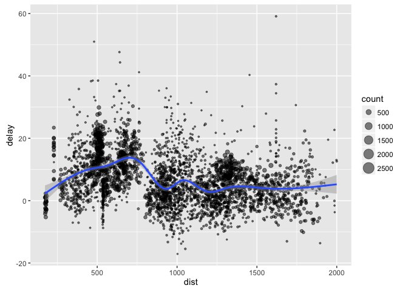

Spark Package
================

A set of tools to provision, connect and interface to Apache Spark from within the R language and ecosystem. This package supports connecting to local and remote Apache Spark clusters and provides support for R packages like dplyr and DBI.

Installation
------------

Install various versions of Spark using the `spark_install` function:

``` r
spark_install(version = "1.6.0")
```

dplyr
-----

The spark package implements a dplyr back-end for Spark.

``` r
# connect to local spark instance and get a dplyr interface
sc <- spark_connect("local")
db <- src_spark(sc)

# copy the flights table to Spark
copy_to(db, flights, "flights")
```

    ## [1] TRUE

``` r
# filter by departure delay and print the first few records
tbl(db, "flights") %>% filter(dep_delay == 2) %>% head
```

    ## Source: local data frame [6 x 19]
    ## 
    ##    year month   day dep_time sched_dep_time dep_delay arr_time
    ## * <int> <int> <int>    <int>          <int>     <dbl>    <int>
    ## 1  2013     1     1      517            515         2      830
    ## 2  2013     1     1      542            540         2      923
    ## 3  2013     1     1      702            700         2     1058
    ## 4  2013     1     1      715            713         2      911
    ## 5  2013     1     1      752            750         2     1025
    ## 6  2013     1     1      917            915         2     1206
    ## Variables not shown: sched_arr_time <int>, arr_delay <dbl>, carrier <chr>,
    ##   flight <int>, tailnum <chr>, origin <chr>, dest <chr>, air_time <dbl>,
    ##   distance <dbl>, hour <dbl>, minute <dbl>, time_hour <dbl>.

ggplot2
-------

Filter and aggregate data then plot it with ggplot2:

``` r
# summarize delays for plotting
delay <- tbl(db, "flights") %>% 
          group_by(tailnum) %>%
          summarise(count = n(), dist = mean(distance), delay = mean(arr_delay)) %>%
          filter(count > 20, dist < 2000) %>%
          collect
    
# plot delays
ggplot(delay, aes(dist, delay)) +
  geom_point(aes(size = count), alpha = 1/2) +
  geom_smooth() +
  scale_size_area()
```



Window functions
----------------

[Window functions](https://cran.r-project.org/web/packages/dplyr/vignettes/window-functions.html) provides more advanced examples that can also be used with spark. For example:

``` r
# copy the Batting table to Spark
copy_to(db, Batting, "batting")
```

    ## [1] TRUE

``` r
# select and display 
select(tbl(db, "batting"), playerID, yearID, teamID, G, AB:H) %>%
  arrange(playerID, yearID, teamID) %>%
  group_by(playerID) %>%
  filter(min_rank(desc(H)) <= 2 & H > 0) %>%
  head
```

    ## Source: local data frame [6 x 7]
    ## Groups: playerID [3]
    ## 
    ##    playerID yearID teamID     G    AB     R     H
    ## *     <chr>  <int>  <chr> <int> <int> <int> <int>
    ## 1 anderal01   1941    PIT    70   223    32    48
    ## 2 anderal01   1942    PIT    54   166    24    45
    ## 3 balesco01   2008    WAS    15    15     1     3
    ## 4 balesco01   2009    WAS     7     8     0     1
    ## 5 bandoch01   1986    CLE    92   254    28    68
    ## 6 bandoch01   1984    CLE    75   220    38    64

Extensibility
-------------

Spark provides low level access to native JVM objects, this topic targets users creating packages based on low-level spark integration. Here's an example of an R `count_lines` function built by calling Spark functions for reading and counting the lines of a text file.

``` r
# define an R interface to Spark line counting
count_lines <- function(sc, path) {
  read <- spark_invoke(sc, spark_context(sc), "textFile", path)
  spark_invoke(sc, read, "count")
}

# write a CSV 
tempfile <- tempfile(fileext = ".csv")
write.csv(flights, tempfile, row.names = FALSE, na = "")

# call spark to count the lines
count_lines(sc, tempfile)
```

    ## [1] 336777

Connection Utilities
--------------------

You can view the Spark web console using the `spark_web` function:

``` r
spark_web(sc)
```

You can show the log using the `spark_log` function:

``` r
spark_log(sc, n = 10)
```

    ##  [1] "16/05/12 08:10:38 INFO TaskSchedulerImpl: Adding task set 11.0 with 1 tasks"                                                                   
    ##  [2] "16/05/12 08:10:38 INFO TaskSetManager: Starting task 0.0 in stage 11.0 (TID 407, localhost, partition 0,PROCESS_LOCAL, 2424 bytes)"            
    ##  [3] "16/05/12 08:10:38 INFO Executor: Running task 0.0 in stage 11.0 (TID 407)"                                                                     
    ##  [4] "16/05/12 08:10:38 INFO HadoopRDD: Input split: file:/var/folders/st/b1kz7ydn54nfzfsrl7_hggyc0000gn/T/RtmpLbXdQo/filee3ef7a5b908.csv:0+33313106"
    ##  [5] "16/05/12 08:10:38 INFO BlockManagerInfo: Removed broadcast_14_piece0 on localhost:58633 in memory (size: 11.0 KB, free: 511.4 MB)"             
    ##  [6] "16/05/12 08:10:38 INFO Executor: Finished task 0.0 in stage 11.0 (TID 407). 2082 bytes result sent to driver"                                  
    ##  [7] "16/05/12 08:10:38 INFO TaskSetManager: Finished task 0.0 in stage 11.0 (TID 407) in 107 ms on localhost (1/1)"                                 
    ##  [8] "16/05/12 08:10:38 INFO TaskSchedulerImpl: Removed TaskSet 11.0, whose tasks have all completed, from pool "                                    
    ##  [9] "16/05/12 08:10:38 INFO DAGScheduler: ResultStage 11 (count at NativeMethodAccessorImpl.java:-2) finished in 0.107 s"                           
    ## [10] "16/05/12 08:10:38 INFO DAGScheduler: Job 7 finished: count at NativeMethodAccessorImpl.java:-2, took 0.110674 s"

Finally, we disconnect from Spark:

``` r
spark_disconnect(sc)
```
