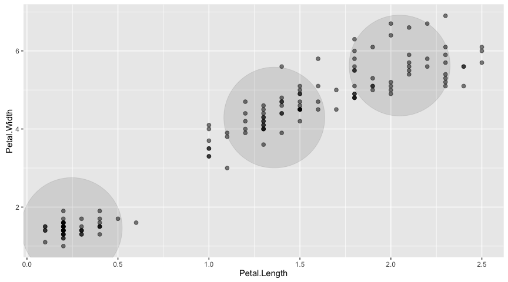

RSpark ML: Draft
================

KMeans in R
-----------

``` r
library(dplyr)
```

    ## 
    ## Attaching package: 'dplyr'

    ## The following objects are masked from 'package:stats':
    ## 
    ##     filter, lag

    ## The following objects are masked from 'package:base':
    ## 
    ##     intersect, setdiff, setequal, union

``` r
library(ggplot2)
```

    ## Warning: package 'ggplot2' was built under R version 3.2.4

``` r
cl <- iris %>%
  select(Petal.Width, Petal.Length) %>%
  kmeans(3)

centers <- as.data.frame(cl$centers)

iris %>%
  select(Petal.Width, Petal.Length) %>%
  ggplot(aes(x=Petal.Length, y=Petal.Width)) +
    geom_point(data=centers, aes(x=Petal.Width,y=Petal.Length), size=60, alpha=0.1) +
    geom_point(data=iris, aes(x=Petal.Width,y=Petal.Length), size=2, alpha=0.5)
```



Draft: KMeans in RSpark
-----------------------

Basing kmeans over Spark on \[<http://spark.apache.org/docs/latest/mllib-clustering.html>\]

``` r
library(rspark)
library(dplyr)

sc <- spark_connect("local", cores = "auto", version = "2.0.0-preview")
db <- src_spark(sc)

# copy the iris table to Spark
names(iris) <- gsub("[^a-zA-Z0-9]", "_", names(iris))
copy_to(db, iris, "iris")
iris_tbl <- tbl(db, "iris")

centers <- iris_tbl %>%
  select(Petal_Width, Petal_Length) %>%
  rspark:::spark_mllib_kmeans(3)

centers
```

    ## [[1]]
    ## <jobj [49]>
    ##   class org.apache.spark.mllib.linalg.DenseVector
    ##   [0.0,0.0]
    ## 
    ## [[2]]
    ## <jobj [50]>
    ##   class org.apache.spark.mllib.linalg.DenseVector
    ##   [0.0,0.0]
    ## 
    ## [[3]]
    ## <jobj [51]>
    ##   class org.apache.spark.mllib.linalg.DenseVector
    ##   [0.0,0.0]

``` r
# iris_tbl %>%
#  select(Petal.Width, Petal.Length) %>%
#  collect %>%
#  ggplot(aes(x=Petal.Length, y=Petal.Width)) +
#    geom_point(aes(x=Petal.Width,y=Petal.Length), size=2, alpha=0.5)
```

``` r
spark_disconnect(sc)
```
