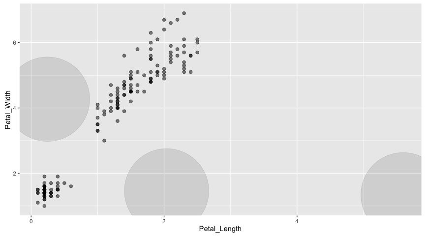

RSpark ML: Draft
================

KMeans in R
-----------

``` r
library(dplyr)
```

    ## 
    ## Attaching package: 'dplyr'

    ## The following objects are masked from 'package:stats':
    ## 
    ##     filter, lag

    ## The following objects are masked from 'package:base':
    ## 
    ##     intersect, setdiff, setequal, union

``` r
library(ggplot2)
```

    ## Warning: package 'ggplot2' was built under R version 3.2.4

``` r
cl <- iris %>%
  select(Petal.Width, Petal.Length) %>%
  kmeans(3)

centers <- as.data.frame(cl$centers)

iris %>%
  select(Petal.Width, Petal.Length) %>%
  ggplot(aes(x=Petal.Length, y=Petal.Width)) +
    geom_point(data=centers, aes(x=Petal.Width,y=Petal.Length), size=60, alpha=0.1) +
    geom_point(data=iris, aes(x=Petal.Width,y=Petal.Length), size=2, alpha=0.5)
```


Draft: KMeans in RSpark
-----------------------

``` r
library(rspark)

sc <- spark_connect("local", cores = "auto", version = "1.6.1")
db <- src_spark(sc)

# copy the iris table to Spark
copy_to(db, iris, "iris")
iris_tbl <- tbl(db, "iris")

iris_tbl %>%
  select(Petal.Width, Petal.Length) %>%
  collect %>%
  ggplot(aes(x=Petal.Length, y=Petal.Width)) +
    geom_point(aes(x=Petal.Width,y=Petal.Length), size=2, alpha=0.5)
```



``` r
spark_disconnect(sc)
```
