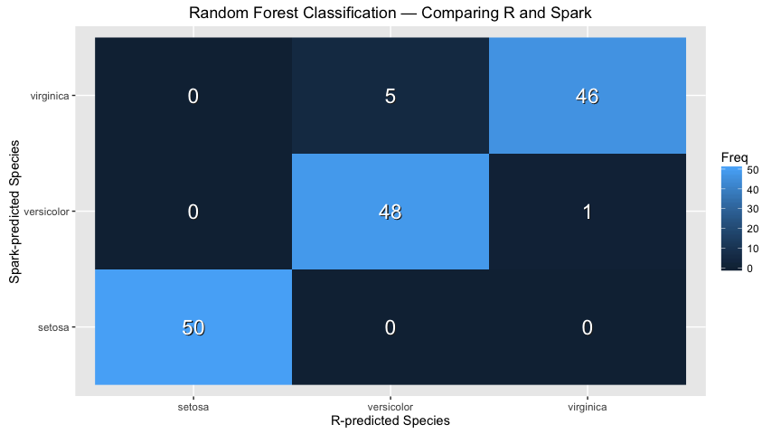
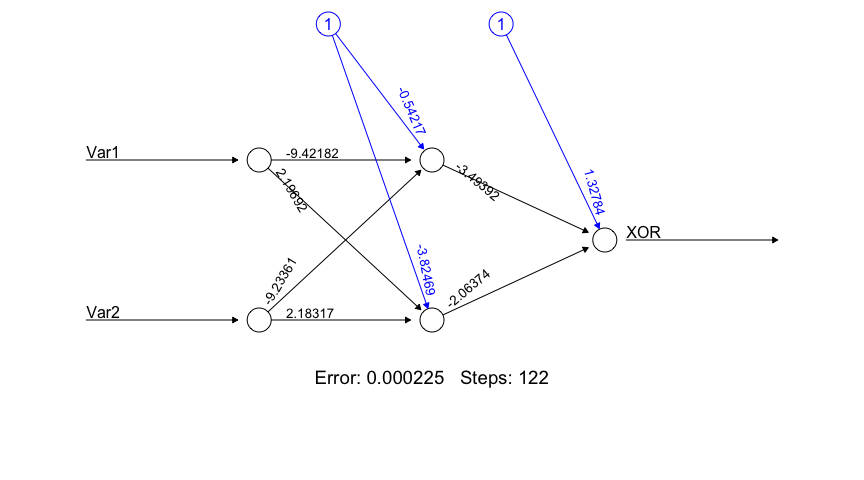

Spark ML: Examples
================

Initialization
--------------

``` r
library(sparklyr)
library(dplyr)
```

    ## 
    ## Attaching package: 'dplyr'

    ## The following objects are masked from 'package:stats':
    ## 
    ##     filter, lag

    ## The following objects are masked from 'package:base':
    ## 
    ##     intersect, setdiff, setequal, union

``` r
library(ggplot2)

sc <- spark_connect("local", version = "1.6.1")
iris_tbl <- copy_to(sc, iris, "iris", overwrite = TRUE)
```

    ## The following columns have been renamed:
    ## - 'Sepal.Length' => 'Sepal_Length' (#1)
    ## - 'Sepal.Width'  => 'Sepal_Width'  (#2)
    ## - 'Petal.Length' => 'Petal_Length' (#3)
    ## - 'Petal.Width'  => 'Petal_Width'  (#4)

KMeans in R
-----------

``` r
cl <- iris %>%
  select(Petal.Width, Petal.Length) %>%
  kmeans(centers = 3)

centers <- as.data.frame(cl$centers)

iris %>%
  select(Petal.Width, Petal.Length) %>%
  ggplot(aes(Petal.Length, Petal.Width)) +
    geom_point(data = centers, aes(Petal.Width, Petal.Length), size = 60, alpha = 0.1) +
    geom_point(data = iris, aes(Petal.Width, Petal.Length), size = 2, alpha = 0.5)
```


KMeans in Spark
---------------

``` r
model <- iris_tbl %>%
  select(Petal_Width, Petal_Length) %>%
  ml_kmeans(centers = 3)

iris_tbl %>%
  select(Petal_Width, Petal_Length) %>%
  collect %>%
  ggplot(aes(Petal_Length, Petal_Width)) +
    geom_point(data = model$centers, aes(Petal_Width, Petal_Length), size = 60, alpha = 0.1) +
    geom_point(aes(Petal_Width, Petal_Length), size = 2, alpha = 0.5)
```


Linear Regression in R
----------------------

``` r
model <- lm(Petal.Length ~ Petal.Width, data = iris)

iris %>%
  select(Petal.Width, Petal.Length) %>%
  ggplot(aes(Petal.Length, Petal.Width)) +
    geom_point(data = iris, aes(Petal.Width, Petal.Length), size = 2, alpha = 0.5) +
    geom_abline(aes(slope = coef(model)[["Petal.Width"]],
                    intercept = coef(model)[["(Intercept)"]],
                    color = "red"))
```


Linear Regression in Spark
--------------------------

``` r
model <- iris_tbl %>%
  select(Petal_Width, Petal_Length) %>%
  ml_linear_regression(response = "Petal_Length", features = c("Petal_Width"))

iris_tbl %>%
  select(Petal_Width, Petal_Length) %>%
  collect %>%
  ggplot(aes(Petal_Length, Petal_Width)) +
    geom_point(aes(Petal_Width, Petal_Length), size = 2, alpha = 0.5) +
    geom_abline(aes(slope = coef(model)[["Petal_Width"]],
                    intercept = coef(model)[["(Intercept)"]],
                    color = "red"))
```


Logistic Regression in R
------------------------

``` r
# Prepare beaver dataset
beaver <- beaver2
beaver$activ <- factor(beaver$activ, labels = c("Non-Active", "Active"))

# Fit model
model <- glm(activ ~ temp, data = beaver, family = binomial(link = "logit"))
print(model)
```

    ## 
    ## Call:  glm(formula = activ ~ temp, family = binomial(link = "logit"), 
    ##     data = beaver)
    ## 
    ## Coefficients:
    ## (Intercept)         temp  
    ##     -550.53        14.69  
    ## 
    ## Degrees of Freedom: 99 Total (i.e. Null);  98 Residual
    ## Null Deviance:       132.8 
    ## Residual Deviance: 18.73     AIC: 22.73

``` r
# Plot prediction curve
newdata <- data.frame(
  temp = seq(min(beaver$temp), max(beaver$temp), length.out = 128)
)

df <- data.frame(
  x = newdata$temp,
  y = predict(model, newdata = newdata, type = "response") + 1
)

ggplot(beaver, aes(x = temp, y = activ)) +
  geom_point() +
  geom_line(data = df, aes(x, y), col = "red") +
  labs(
    x = "Body Temperature (ºC)",
    y = "Activity",
    title = "Beaver Activity vs. Body Temperature",
    subtitle = "From R's built-in 'beaver2' dataset"
  )
```


Logistic Regression in Spark
----------------------------

``` r
beaver_tbl <- copy_to(sc, beaver, "beaver", overwrite = TRUE)

model <- beaver_tbl %>%
  mutate(response = as.numeric(activ == "Active")) %>%
  ml_logistic_regression(response = "response", features = "temp")

print(model)
```

    ## Call: response ~ temp
    ## 
    ## Coefficients:
    ## (Intercept)        temp 
    ##  -550.52331    14.69184

Survival Regression in R
------------------------

``` r
library(survival)
data(ovarian, package = "survival")

fit <- survreg(
  Surv(futime, fustat) ~ ecog.ps + rx,
  data = ovarian,
  dist = "weibull"
)

coefficients(fit)
```

    ## (Intercept)     ecog.ps          rx 
    ##   6.8966931  -0.3850425   0.5286455

Survival Regression in Spark
----------------------------

``` r
ovarian_tbl <- copy_to(sc, ovarian, overwrite = TRUE)
```

    ## The following columns have been renamed:
    ## - 'resid.ds' => 'resid_ds' (#4)
    ## - 'ecog.ps'  => 'ecog_ps'  (#6)

``` r
fit <- ovarian_tbl %>%
  ml_survival_regression(
    response = "futime",
    censor = "fustat",
    features = c("ecog_ps", "rx")
  )

coefficients(fit)
```

    ## (Intercept)     ecog_ps          rx 
    ##   6.8966932  -0.3850426   0.5286455

Partitioning in R
-----------------

``` r
set.seed(1099)
ratio <- 0.75
trainingSize <- floor(ratio * nrow(iris))
indices <- sample(seq_len(nrow(iris)), size = trainingSize)

training <- iris[ indices, ]
test     <- iris[-indices, ]

fit <- lm(Petal.Length ~ Petal.Width, data = iris)
predict(fit, newdata = test)
```

    ##        1        6       15       16       19       30       33       34 
    ## 1.529546 1.975534 1.529546 1.975534 1.752540 1.529546 1.306552 1.529546 
    ##       35       41       42       50       58       70       75       77 
    ## 1.529546 1.752540 1.752540 1.529546 3.313499 3.536493 3.982481 4.205475 
    ##       84       85       89       90       95       96       97       98 
    ## 4.651463 4.428469 3.982481 3.982481 3.982481 3.759487 3.982481 3.982481 
    ##       99      101      106      108      113      126      128      129 
    ## 3.536493 6.658409 5.766433 5.097451 5.766433 5.097451 5.097451 5.766433 
    ##      130      132      141      144      146      147 
    ## 4.651463 5.543439 6.435415 6.212421 6.212421 5.320445

Partitioning in Spark
---------------------

``` r
partitions <- tbl(sc, "iris") %>%
  sdf_partition(training = 0.75, test = 0.25, seed = 1099)

fit <- partitions$training %>%
  ml_linear_regression(response = "Petal_Length", features = c("Petal_Width"))

predict(fit, partitions$test)
```

    ##  [1] 1.743840 1.524058 1.524058 1.524058 3.282310 1.963621 2.183403
    ##  [8] 1.524058 1.524058 1.524058 3.941654 3.282310 1.524058 4.381216
    ## [15] 3.721872 3.941654 4.161435 4.161435 3.941654 3.941654 3.721872
    ## [22] 5.260342 4.600998 4.161435 5.040561 6.139468 4.381216 5.699905
    ## [29] 5.699905 6.139468 5.699905 4.600998 5.699905 6.139468 6.139468
    ## [36] 5.919686

Principal Components Analysis in R
----------------------------------

``` r
model <- iris %>%
  select(-Species) %>%
  prcomp()
print(model)
```

    ## Standard deviations:
    ## [1] 2.0562689 0.4926162 0.2796596 0.1543862
    ## 
    ## Rotation:
    ##                      PC1         PC2         PC3        PC4
    ## Sepal.Length  0.36138659 -0.65658877  0.58202985  0.3154872
    ## Sepal.Width  -0.08452251 -0.73016143 -0.59791083 -0.3197231
    ## Petal.Length  0.85667061  0.17337266 -0.07623608 -0.4798390
    ## Petal.Width   0.35828920  0.07548102 -0.54583143  0.7536574

``` r
# calculate explained variance
model$sdev^2 / sum(model$sdev^2)
```

    ## [1] 0.924618723 0.053066483 0.017102610 0.005212184

Principal Components Analysis in Spark
--------------------------------------

``` r
model <- tbl(sc, "iris") %>%
  select(-Species) %>%
  ml_pca()
print(model)
```

    ## Explained variance:
    ## [not available in this version of Spark]
    ## 
    ## Rotation:
    ##                      PC1         PC2         PC3        PC4
    ## Sepal_Length -0.36138659 -0.65658877  0.58202985  0.3154872
    ## Sepal_Width   0.08452251 -0.73016143 -0.59791083 -0.3197231
    ## Petal_Length -0.85667061  0.17337266 -0.07623608 -0.4798390
    ## Petal_Width  -0.35828920  0.07548102 -0.54583143  0.7536574

Random Forests with R
---------------------

``` r
rForest <- randomForest::randomForest(
  Species ~ Petal.Length + Petal.Width,
  ntree = 20L,
  nodesize = 20L,
  data = iris
)
rPredict <- predict(rForest, iris)
head(rPredict)
```

    ##      1      2      3      4      5      6 
    ## setosa setosa setosa setosa setosa setosa 
    ## Levels: setosa versicolor virginica

Random Forests with Spark
-------------------------

``` r
mForest <- iris_tbl %>%
  ml_random_forest(
    response = "Species",
    features = c("Petal_Length", "Petal_Width"),
    max.bins = 32L,
    max.depth = 5L,
    num.trees = 20L
  )
mPredict <- predict(mForest, iris_tbl)
head(mPredict)
```

    ## [1] "setosa" "setosa" "setosa" "setosa" "setosa" "setosa"

Comparing Random Forest Classification
--------------------------------------

Using the model to predict the same data it was trained on is certainly not best practice, but it at least showcases that the results produced are concordant between R and Spark.

``` r
df <- as.data.frame(table(x = rPredict, y = mPredict), stringsAsFactors = FALSE)

ggplot(df) +
  geom_raster(aes(x, y, fill = Freq)) +
  geom_text(aes(x, y, label = Freq), col = "#222222", size = 6, nudge_x = 0.005, nudge_y = -0.005) +
  geom_text(aes(x, y, label = Freq), col = "white", size = 6) +
  labs(
    x = "R-predicted Species",
    y = "Spark-predicted Species",
    title = "Random Forest Classification — Comparing R and Spark")
```



Neural Networks with R
----------------------

``` r
library(neuralnet)
```

    ## Loading required package: grid

    ## Loading required package: MASS

    ## 
    ## Attaching package: 'MASS'

    ## The following object is masked from 'package:dplyr':
    ## 
    ##     select

    ## 
    ## Attaching package: 'neuralnet'

    ## The following object is masked from 'package:dplyr':
    ## 
    ##     compute

``` r
XOR <- c(0,1,1,0)
xor.data <- data.frame(expand.grid(c(0,1), c(0,1)), XOR)

xor.data
```

    ##   Var1 Var2 XOR
    ## 1    0    0   0
    ## 2    1    0   1
    ## 3    0    1   1
    ## 4    1    1   0

``` r
net.xor <- neuralnet( XOR~Var1+Var2, xor.data, hidden = 2, rep = 5)
plot(net.xor, rep="best")
```



Decision Tree with Spark
------------------------

``` r
mDecisionTree <- iris_tbl %>%
  ml_decision_tree(
    response = "Species",
    features = c("Petal_Length", "Petal_Width"),
    max.bins = 32L,
    max.depth = 5L
  )
mPredict <- predict(mDecisionTree, iris_tbl)
head(mPredict)
```

    ## [1] "setosa" "setosa" "setosa" "setosa" "setosa" "setosa"

Naive-Bayes with Spark
----------------------

``` r
mNaiveBayes <- iris_tbl %>%
  ml_naive_bayes(
    response = "Species",
    features = c("Petal_Length", "Petal_Width")
  )
mPredict <- predict(mNaiveBayes, iris_tbl)
head(mPredict)
```

    ## [1] "setosa"     "setosa"     "setosa"     "setosa"     "setosa"    
    ## [6] "versicolor"

Cleanup
-------

``` r
spark_disconnect(sc)
```
