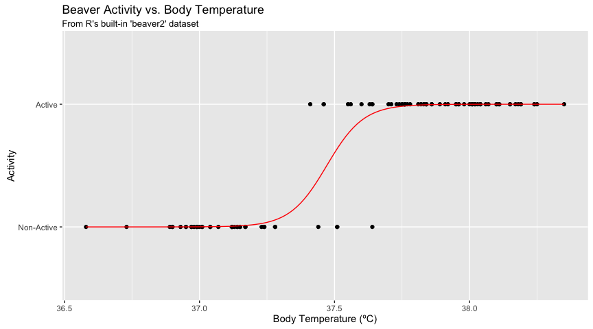
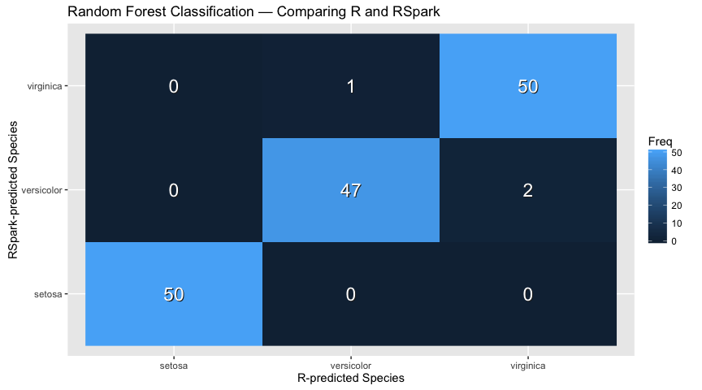

RSpark ML: Examples
================

Initialization
--------------

``` r
library(rspark)
library(dplyr)
```

    ## 
    ## Attaching package: 'dplyr'

    ## The following objects are masked from 'package:stats':
    ## 
    ##     filter, lag

    ## The following objects are masked from 'package:base':
    ## 
    ##     intersect, setdiff, setequal, union

``` r
library(ggplot2)

sc <- spark_connect("local", cores = "auto", version = "2.0.0-preview")
db <- src_spark(sc)

copy_to(db, iris, "iris")
iris_tbl <- tbl(db, "iris")
```

KMeans in R
-----------

``` r
cl <- iris %>%
  select(Petal.Width, Petal.Length) %>%
  kmeans(centers = 3)

centers <- as.data.frame(cl$centers)

iris %>%
  select(Petal.Width, Petal.Length) %>%
  ggplot(aes(Petal.Length, Petal.Width)) +
    geom_point(data = centers, aes(Petal.Width, Petal.Length), size = 60, alpha = 0.1) +
    geom_point(data = iris, aes(Petal.Width, Petal.Length), size = 2, alpha = 0.5)
```


KMeans in RSpark
----------------

Basing kmeans over Spark on [spark.mllib K-means](http://spark.apache.org/docs/latest/mllib-clustering.html#k-means)

Note that the names of variables within the iris `tbl` have been transformed (replacing `.` with `_`) to work around an issue in the Spark 2.0.0-preview used in constructing this document -- we expect the issue to be resolved with the release of Spark 2.0.0.

``` r
model <- tbl(db, "iris") %>%
  select(Petal_Width, Petal_Length) %>%
  ml_kmeans(centers = 3)

tbl(db, "iris") %>%
  select(Petal_Width, Petal_Length) %>%
  collect %>%
  ggplot(aes(Petal_Length, Petal_Width)) +
    geom_point(data = model$centers, aes(Petal_Width, Petal_Length), size = 60, alpha = 0.1) +
    geom_point(aes(Petal_Width, Petal_Length), size = 2, alpha = 0.5)
```


Linear Regression in R
----------------------

``` r
model <- lm(Petal.Length ~ Petal.Width, data = iris)

iris %>%
  select(Petal.Width, Petal.Length) %>%
  ggplot(aes(Petal.Length, Petal.Width)) +
    geom_point(data = iris, aes(Petal.Width, Petal.Length), size = 2, alpha = 0.5) +
    geom_abline(aes(slope = coef(model)[["Petal.Width"]],
                    intercept = coef(model)[["(Intercept)"]],
                    color = "red"))
```


Linear Regression in RSpark
---------------------------

``` r
model <- tbl(db, "iris") %>%
  select(Petal_Width, Petal_Length) %>%
  ml_linear_regression(response = "Petal_Length", features = c("Petal_Width"))

iris %>%
  select(Petal.Width, Petal.Length) %>%
  ggplot(aes(Petal.Length, Petal.Width)) +
    geom_point(data = iris, aes(Petal.Width, Petal.Length), size = 2, alpha = 0.5) +
    geom_abline(aes(slope = coef(model)[["Petal_Width"]],
                    intercept = coef(model)[["(Intercept)"]],
                    color = "red"))
```


Logistic Regression in R
------------------------

``` r
# Prepare beaver dataset
beaver <- beaver2
beaver$activ <- factor(beaver$activ, labels = c("Non-Active", "Active"))

# Fit model
model <- glm(activ ~ temp, data = beaver, family = binomial(link = "logit"))
print(model)
```

    ## 
    ## Call:  glm(formula = activ ~ temp, family = binomial(link = "logit"), 
    ##     data = beaver)
    ## 
    ## Coefficients:
    ## (Intercept)         temp  
    ##     -550.53        14.69  
    ## 
    ## Degrees of Freedom: 99 Total (i.e. Null);  98 Residual
    ## Null Deviance:       132.8 
    ## Residual Deviance: 18.73     AIC: 22.73

``` r
# Plot prediction curve
newdata <- data.frame(
  temp = seq(min(beaver$temp), max(beaver$temp), length.out = 128)
)

df <- data.frame(
  x = newdata$temp,
  y = predict(model, newdata = newdata, type = "response") + 1
)

ggplot(beaver, aes(x = temp, y = activ)) +
  geom_point() +
  geom_line(data = df, aes(x, y), col = "red") +
  labs(
    x = "Body Temperature (ºC)",
    y = "Activity",
    title = "Beaver Activity vs. Body Temperature",
    subtitle = "From R's built-in 'beaver2' dataset"
  )
```



Logistic Regression in RSpark
-----------------------------

``` r
copy_to(db, beaver, "beaver")
beaver_tbl <- tbl(db, "beaver")

model <- beaver_tbl %>%
  mutate(response = as.numeric(activ == "Active")) %>%
  ml_logistic_regression(response = "response", features = "temp")

print(model)
```

    ## Call: response ~ temp
    ## 
    ## Coefficients:
    ##        temp (Intercept) 
    ##    4.846724 -181.697214

Partitioning in R
-----------------

``` r
ratio <- 0.75
trainingSize <- floor(ratio * nrow(iris))
indices <- sample(seq_len(nrow(iris)), size = trainingSize)

training <- iris[ indices, ]
test     <- iris[-indices, ]

fit <- lm(Petal.Length ~ Petal.Width, data = iris)
predict(fit, newdata = test)
```

    ##        1        2        3        7       10       13       14       15 
    ## 1.529546 1.529546 1.529546 1.752540 1.306552 1.306552 1.306552 1.529546 
    ##       18       20       24       28       34       37       40       41 
    ## 1.752540 1.752540 2.198528 1.529546 1.529546 1.529546 1.529546 1.752540 
    ##       42       50       53       58       59       61       66       71 
    ## 1.752540 1.529546 4.428469 3.313499 3.982481 3.313499 4.205475 5.097451 
    ##       72       73       74       75       84       89       96       97 
    ## 3.982481 4.428469 3.759487 3.982481 4.651463 3.982481 3.759487 3.982481 
    ##      127      135      138      139      144      149 
    ## 5.097451 4.205475 5.097451 5.097451 6.212421 6.212421

Partitioning in RSpark
----------------------

``` r
partitions <- tbl(db, "iris") %>%
  partition(training = 0.75, test = 0.25)

fit <- partitions$training %>%
  ml_linear_regression(response = "Petal_Length", features = c("Petal_Width"))

predict(fit, partitions$test)
```

    ##  [1] 1.604507 1.604507 1.604507 1.823633 1.604507 1.823633 1.604507
    ##  [8] 1.604507 4.891390 1.604507 1.385382 3.357511 3.357511 1.823633
    ## [15] 2.481009 2.261884 1.823633 1.385382 4.014888 1.604507 5.548767
    ## [22] 4.453139 5.548767 3.357511 4.014888 3.795762 3.795762 5.329641
    ## [29] 1.604507 5.110515 4.672264 4.014888 6.206143 4.453139 5.329641
    ## [36] 5.987018 4.234013 5.110515 6.206143 6.425269 5.767892 6.206143
    ## [43] 5.110515 5.329641 5.767892 6.206143 6.206143 5.987018

Principal Components Analysis in R
----------------------------------

``` r
model <- iris %>%
  select(-Species) %>%
  prcomp()
print(model)
```

    ## Standard deviations:
    ## [1] 2.0562689 0.4926162 0.2796596 0.1543862
    ## 
    ## Rotation:
    ##                      PC1         PC2         PC3        PC4
    ## Sepal.Length  0.36138659 -0.65658877  0.58202985  0.3154872
    ## Sepal.Width  -0.08452251 -0.73016143 -0.59791083 -0.3197231
    ## Petal.Length  0.85667061  0.17337266 -0.07623608 -0.4798390
    ## Petal.Width   0.35828920  0.07548102 -0.54583143  0.7536574

``` r
# calculate explained variance
model$sdev^2 / sum(model$sdev^2)
```

    ## [1] 0.924618723 0.053066483 0.017102610 0.005212184

Principal Components Analysis in RSpark
---------------------------------------

``` r
model <- tbl(db, "iris") %>%
  select(-Species) %>%
  ml_pca()
print(model)
```

    ## Explained variance:
    ##         PC1         PC2         PC3         PC4 
    ## 0.924618723 0.053066483 0.017102610 0.005212184 
    ## 
    ## Rotation:
    ##                      PC1         PC2         PC3        PC4
    ## Sepal_Length -0.36138659 -0.65658877  0.58202985  0.3154872
    ## Sepal_Width   0.08452251 -0.73016143 -0.59791083 -0.3197231
    ## Petal_Length -0.85667061  0.17337266 -0.07623608 -0.4798390
    ## Petal_Width  -0.35828920  0.07548102 -0.54583143  0.7536574

Random Forests with R
---------------------

``` r
rForest <- randomForest::randomForest(
  Species ~ Petal.Length + Petal.Width,
  ntree = 20L,
  nodesize = 20L,
  data = iris
)
rPredict <- predict(rForest, iris)
head(rPredict)
```

    ##      1      2      3      4      5      6 
    ## setosa setosa setosa setosa setosa setosa 
    ## Levels: setosa versicolor virginica

Random Forests with RSpark
--------------------------

``` r
mForest <- iris_tbl %>%
  ml_random_forest(
    response = "Species",
    features = c("Petal_Length", "Petal_Width"),
    max.bins = 32L,
    max.depth = 5L,
    num.trees = 20L
  )
mPredict <- predict(mForest, iris_tbl)
head(mPredict)
```

    ## [1] "setosa" "setosa" "setosa" "setosa" "setosa" "setosa"

Comparing Random Forest Classification
--------------------------------------

Using the model to predict the same data it was trained on is certainly not best practice, but it at least showcases that the results produced are concordant between R and RSpark.

``` r
df <- as.data.frame(table(x = rPredict, y = mPredict), stringsAsFactors = FALSE)
ggplot(df) +
  geom_raster(aes(x, y, fill = Freq)) +
  geom_text(aes(x, y, label = Freq), col = "#222222", size = 6, nudge_x = 0.005, nudge_y = -0.005) +
  geom_text(aes(x, y, label = Freq), col = "white", size = 6) +
  labs(
    x = "R-predicted Species",
    y = "RSpark-predicted Species",
    title = "Random Forest Classification — Comparing R and RSpark"
  )
```



Cleanup
-------

``` r
spark_disconnect(sc)
```
