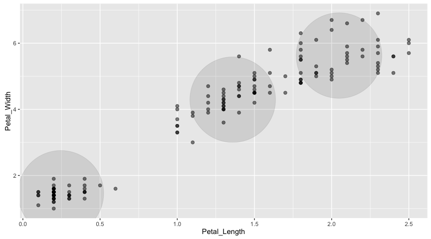
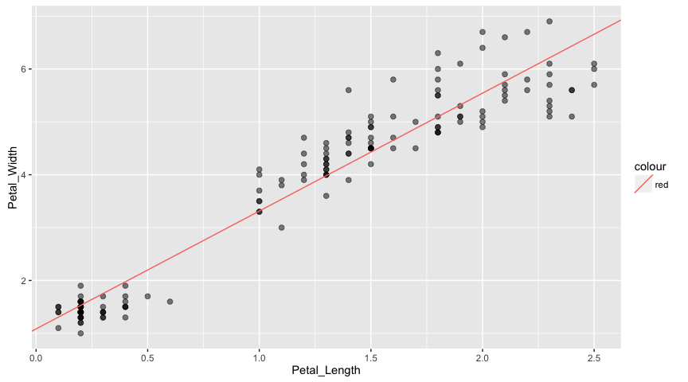

RSpark ML: Examples
================

Initialization
--------------

``` r
library(rspark)
library(dplyr)
```

    ## 
    ## Attaching package: 'dplyr'

    ## The following objects are masked from 'package:stats':
    ## 
    ##     filter, lag

    ## The following objects are masked from 'package:base':
    ## 
    ##     intersect, setdiff, setequal, union

``` r
library(ggplot2)

sc <- spark_connect("local", cores = "auto", version = "2.0.0-preview")
db <- src_spark(sc)

copy_to(db, iris, "iris")
iris_tbl <- tbl(db, "iris")
```

KMeans in R
-----------

``` r
cl <- iris %>%
  select(Petal.Width, Petal.Length) %>%
  kmeans(centers = 3)

centers <- as.data.frame(cl$centers)

iris %>%
  select(Petal.Width, Petal.Length) %>%
  ggplot(aes(Petal.Length, Petal.Width)) +
    geom_point(data = centers, aes(Petal.Width, Petal.Length), size = 60, alpha = 0.1) +
    geom_point(data = iris, aes(Petal.Width, Petal.Length), size = 2, alpha = 0.5)
```



KMeans in RSpark
----------------

Basing kmeans over Spark on [spark.mllib K-means](http://spark.apache.org/docs/latest/mllib-clustering.html#k-means)

Note that the names of variables within the iris `tbl` have been transformed (replacing `.` with `_`) to work around an issue in the Spark 2.0.0-preview used in constructing this document -- we expect the issue to be resolved with the release of Spark 2.0.0.

``` r
model <- tbl(db, "iris") %>%
  select(Petal_Width, Petal_Length) %>%
  ml_kmeans(centers = 3)

tbl(db, "iris") %>%
  select(Petal_Width, Petal_Length) %>%
  collect %>%
  ggplot(aes(Petal_Length, Petal_Width)) +
    geom_point(data = model$centers, aes(Petal_Width, Petal_Length), size = 60, alpha = 0.1) +
    geom_point(aes(Petal_Width, Petal_Length), size = 2, alpha = 0.5)
```


Linear Regression in R
----------------------

``` r
data <- iris %>%
  select(Petal.Width, Petal.Length)

model <- lm(Petal.Length ~ Petal.Width, data = iris)

iris %>%
  select(Petal.Width, Petal.Length) %>%
  ggplot(aes(Petal.Length, Petal.Width)) +
    geom_point(data = iris, aes(Petal.Width, Petal.Length), size = 2, alpha = 0.5) +
    geom_abline(aes(slope = coef(model)[["Petal.Width"]],
                    intercept = coef(model)[["(Intercept)"]],
                    color = "red"))
```



Linear Regression in RSpark
---------------------------

``` r
model <- tbl(db, "iris") %>%
  select(Petal_Width, Petal_Length) %>%
  ml_linear_regression(response = "Petal_Length", features = c("Petal_Width"))

iris %>%
  select(Petal.Width, Petal.Length) %>%
  ggplot(aes(Petal.Length, Petal.Width)) +
    geom_point(data = iris, aes(Petal.Width, Petal.Length), size = 2, alpha = 0.5) +
    geom_abline(aes(slope = coef(model)[["Petal_Width"]],
                    intercept = coef(model)[["(Intercept)"]],
                    color = "red"))
```


Principal Components Analysis in R
----------------------------------

``` r
model <- iris %>%
  select(-Species) %>%
  prcomp()
print(model)
```

    ## Standard deviations:
    ## [1] 2.0562689 0.4926162 0.2796596 0.1543862
    ## 
    ## Rotation:
    ##                      PC1         PC2         PC3        PC4
    ## Sepal.Length  0.36138659 -0.65658877  0.58202985  0.3154872
    ## Sepal.Width  -0.08452251 -0.73016143 -0.59791083 -0.3197231
    ## Petal.Length  0.85667061  0.17337266 -0.07623608 -0.4798390
    ## Petal.Width   0.35828920  0.07548102 -0.54583143  0.7536574

``` r
# calculate explained variance
model$sdev^2 / sum(model$sdev^2)
```

    ## [1] 0.924618723 0.053066483 0.017102610 0.005212184

Principal Components Analysis in RSpark
---------------------------------------

``` r
model <- tbl(db, "iris") %>%
  select(-Species) %>%
  ml_pca()
print(model)
```

    ## Explained variance:
    ##         PC1         PC2         PC3         PC4 
    ## 0.924618723 0.053066483 0.017102610 0.005212184 
    ## 
    ## Rotation:
    ##                      PC1         PC2         PC3        PC4
    ## Sepal_Length -0.36138659 -0.65658877  0.58202985  0.3154872
    ## Sepal_Width   0.08452251 -0.73016143 -0.59791083 -0.3197231
    ## Petal_Length -0.85667061  0.17337266 -0.07623608 -0.4798390
    ## Petal_Width  -0.35828920  0.07548102 -0.54583143  0.7536574

Cleanup
-------

``` r
spark_disconnect(sc)
```
