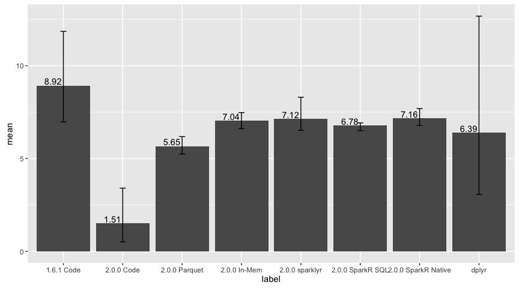

RSpark Performance: 1B Rows
================

Setup
-----

``` r
rspark:::spark_install(version = "2.0.0-SNAPSHOT", reset = TRUE, logging = "WARN")
```

Initialization
--------------

``` r
library(rspark)
library(magrittr)
library(dplyr)
```

    ## 
    ## Attaching package: 'dplyr'

    ## The following objects are masked from 'package:stats':
    ## 
    ##     filter, lag

    ## The following objects are masked from 'package:base':
    ## 
    ##     intersect, setdiff, setequal, union

``` r
library(ggplot2)
```

    ## Warning: package 'ggplot2' was built under R version 3.2.4

``` r
parquetPath <- file.path(getwd(), "billion.parquet")

if (!file.exists(parquetPath)) {
  billion <- spark_invoke_static_ctor(sc, "java.math.BigInteger", "1000000000") %>%
    spark_invoke("longValue")
  
  ses %>%
    spark_invoke("range", as.integer(billion)) %>%
    spark_invoke("toDF") %>%
    spark_invoke("write") %>%
    spark_invoke("save", "billion.parquet")
}

spark_conf <- function(ses, config, value) {
  ses %>%
    spark_invoke("conf") %>%
    spark_invoke("set", config, value)
}

logResults <- function(label, test) {
  runTimes <- lapply(seq_len(3), function(idx) {
    runTime <- system.time({
      sum <- test()
    })
    
    as.data.frame(list(
      label = label,
      time = runTime[[3]],
      sum = sum))
  })
  
  runTimes <- do.call(rbind, runTimes)
  
  as.data.frame(list(
    label = label,
    min = min(runTimes$time),
    max = max(runTimes$time),
    mean = mean(runTimes$time)
  ))
}

sparkTest <- function(test, loadIntoDf = TRUE) {
  sc <- spark_connect(master = "local", version = "2.0.0-preview", memory = "12G")
  sparkSql <- spark_invoke_static_ctor(
    sc,
    "org.apache.spark.sql.SQLContext",
    spark_context(sc)
  )
  
  db <- src_spark(sc)
  ses <- rspark:::spark_sql_or_hive(rspark:::spark_api(db))
  df <- NULL
  
  if (loadIntoDf) {
    df <- sparkSql %>%
      spark_invoke("read") %>%
      spark_invoke("parquet", list(parquetPath))
    
    df %>%
      spark_invoke("cache") %>%
      spark_invoke("count")
  } else {
    invisible(
      load_parquet(db, "billion", parquetPath)
    )
  }
  
  result <- test(sc, db, ses, df)
  
  spark_disconnect(sc)
  result
}
```

Tests
-----

### Sum range from formula

``` r
spark_sum_range <- function(sc, db, ses, df) {
  billion <- spark_invoke_static_ctor(sc, "java.math.BigInteger", "1000000000") %>%
    spark_invoke("longValue")
  
  result <- ses %>%
    spark_invoke("range", as.integer(billion)) %>%
    spark_invoke("toDF", list("x")) %>%
    spark_invoke("selectExpr", list("sum(x)"))
    
  spark_invoke(result, "collect")[[1]]
}
```

### Sum range from parquet

``` r
spark_sum_range_parquet <- function(sc, db, ses, df) {
  df <- spark_invoke(rspark:::spark_sql_or_hive(rspark:::spark_api(db)), "read") %>%
    spark_invoke("parquet", list(parquetPath))
    
  result <- spark_invoke(df, "selectExpr", list("sum(x)")) %>%
    spark_invoke("collect")
  
  result[[1]]
}
```

### Sum range from memory

``` r
spark_sum_range_mem <- function(sc, db, ses, df) {
  df %>%
    spark_invoke("selectExpr", list("sum(x)")) %>%
    spark_invoke("collect")
}
```

### Sum range using rspark

``` r
spark_sum_range_rspark <- function(sc, db, ses, df) {
  tbl(db, "billion") %>%
    summarise(total = sum(x)) %>%
    collect
}
```

### Sum range using SparkR SQL

``` r
spark_sum_range_sparkr_sql_prepare <- function() {
  installInfo <- rspark:::spark_install_info(sparkVersion = "2.0.0-preview", hadoopVersion = "2.6")
  
  Sys.setenv(SPARK_HOME = installInfo$sparkVersionDir)
  library(SparkR, lib.loc = c(file.path(Sys.getenv("SPARK_HOME"), "R", "lib")))
  scR <- sparkR.init(master = "local[*]", sparkEnvir = list(spark.driver.memory="12G"))
  sqlContextR <- sparkRSQL.init(scR)
  df <- loadDF(sqlContextR, parquetPath, "parquet")
  
  registerTempTable(df, "billion")
  
  sql(sqlContextR, "CACHE TABLE billion")
  collect(sql(sqlContextR, "SELECT count(*) FROM billion"))
  
  sqlContextR
}

spark_sum_range_sparkr_sql <- function(sqlContextR) {
  collect(sql(sqlContextR, "SELECT sum(*) FROM billion"))
}

spark_sum_range_sparkr_terminate <- function() {
  sparkR.stop()
  detach(name = "package:SparkR")
}
```

### Sum range using SparkR Native

``` r
spark_sum_range_sparkr_native_prepare <- function() {
  installInfo <- rspark:::spark_install_info(sparkVersion = "2.0.0-preview", hadoopVersion = "2.6")
  
  Sys.setenv(SPARK_HOME = installInfo$sparkVersionDir)
  library(SparkR, lib.loc = c(file.path(Sys.getenv("SPARK_HOME"), "R", "lib")))
  scR <- sparkR.init(master = "local[*]", sparkEnvir = list(spark.driver.memory="12G"))
  sqlContextR <- sparkRSQL.init(scR)
  
  df <- loadDF(sqlContextR, parquetPath, "parquet")
  cache(df)
  count(df)
  
  df
}

spark_sum_range_sparkr_native <- function(df) {
  collect(summarize(df, total = sum(df$x)))
}
```

### Sum range using dplyr

``` r
spark_sum_range_dplyr_prepare <- function() {
  df <- as.data.frame(as.numeric(seq_len(1000000000)))
  colnames(df) <- c("x")
  head(df)
  df
}

spark_sum_range_dplyr <- function(df) {
  df %>% summarise(sum(x))
}
```

Results
-------

### Sum range from formula using 1.6

``` r
runOldCode <- sparkTest(function(sc, db, ses, df) {
  logResults("1.6.1 Code", function() {
    spark_conf(ses, "spark.sql.codegen.wholeStage", "false")
    spark_sum_range(sc, db, ses, df)
  })
})
```

### Sum range from formula using 2.0

``` r
runCode <- sparkTest(function(sc, db, ses, df) {
  logResults("2.0.0 Code", function() {
    spark_conf(ses, "spark.sql.codegen.wholeStage", "true")
    spark_sum_range(sc, db, ses, df)
  })
})
```

### Sum range from parquet

``` r
runParquet <- sparkTest(function(sc, db, ses, df) {
  logResults("2.0.0 Parquet", function() {
    spark_conf(ses, "spark.sql.codegen.wholeStage", "true")
    sum <- spark_sum_range_parquet(sc, db, ses, df)
  })
})
```

### Sum range from memory

``` r
runInMem <- sparkTest(function(sc, db, ses, df) {
  logResults("2.0.0 In-Mem", function() {
    spark_conf(ses, "spark.sql.codegen.wholeStage", "true")
    sum <- spark_sum_range_mem(sc, db, ses, df)
  })
})
```

### Sum range using rspark

``` r
runRSpark <- sparkTest(function(sc, db, ses, df) {
  logResults("2.0.0 rspark", function() {
    spark_conf(ses, "spark.sql.codegen.wholeStage", "true")
    sum <- spark_sum_range_rspark(sc, db, ses, df)
  })
}, loadIntoDf = FALSE)
```

### Sum range using RSpark SQL

``` r
sqlContextR <- spark_sum_range_sparkr_sql_prepare()
```

    ## 
    ## Attaching package: 'SparkR'

    ## The following objects are masked from 'package:dplyr':
    ## 
    ##     arrange, between, collect, contains, count, cume_dist,
    ##     dense_rank, desc, distinct, explain, filter, first, group_by,
    ##     intersect, lag, last, lead, mutate, n, n_distinct, ntile,
    ##     percent_rank, rename, row_number, sample_frac, select, sql,
    ##     summarize

    ## The following objects are masked from 'package:stats':
    ## 
    ##     cov, filter, lag, na.omit, predict, sd, var, window

    ## The following objects are masked from 'package:base':
    ## 
    ##     as.data.frame, colnames, colnames<-, drop, intersect, rank,
    ##     rbind, sample, subset, summary, transform

    ## Launching java with spark-submit command /Users/javierluraschi/Library/Caches/spark/spark-2.0.0-preview-bin-hadoop2.6/bin/spark-submit   --driver-memory "12G" sparkr-shell /var/folders/fz/v6wfsg2x1fb1rw4f6r0x4jwm0000gn/T//Rtmpz7blOh/backend_port841f5e91e175

``` r
runSparkRSQL <- logResults("2.0.0 SparkR SQL", function() {
  sum <- spark_sum_range_sparkr_sql(sqlContextR)
})
spark_sum_range_sparkr_terminate()
```

### Sum range using RSpark SQL

``` r
dfSparkR <- spark_sum_range_sparkr_native_prepare()
```

    ## 
    ## Attaching package: 'SparkR'

    ## The following objects are masked from 'package:dplyr':
    ## 
    ##     arrange, between, collect, contains, count, cume_dist,
    ##     dense_rank, desc, distinct, explain, filter, first, group_by,
    ##     intersect, lag, last, lead, mutate, n, n_distinct, ntile,
    ##     percent_rank, rename, row_number, sample_frac, select, sql,
    ##     summarize

    ## The following objects are masked from 'package:stats':
    ## 
    ##     cov, filter, lag, na.omit, predict, sd, var, window

    ## The following objects are masked from 'package:base':
    ## 
    ##     as.data.frame, colnames, colnames<-, drop, intersect, rank,
    ##     rbind, sample, subset, summary, transform

    ## Launching java with spark-submit command /Users/javierluraschi/Library/Caches/spark/spark-2.0.0-preview-bin-hadoop2.6/bin/spark-submit   --driver-memory "12G" sparkr-shell /var/folders/fz/v6wfsg2x1fb1rw4f6r0x4jwm0000gn/T//Rtmpz7blOh/backend_port841f68a844c4

``` r
runSparkRNative <- logResults("2.0.0 SparkR Native", function() {
  sum <- spark_sum_range_sparkr_native(dfSparkR)
})
spark_sum_range_sparkr_terminate()
```

### Sum range using dplyr

``` r
dplyrDf <- spark_sum_range_dplyr_prepare()
runDplyr <- logResults("dplyr", function() {
  sum <- spark_sum_range_dplyr(dplyrDf)
})
dplyrDf <- NULL
```

Results
-------

``` r
allRuns <- lapply(
  list(
    runOldCode,
    runCode,
    runParquet,
    runInMem,
    runRSpark,
    runSparkRSQL,
    runSparkRNative,
    runDplyr
  ),
  function(e) {
    colnames(e) <- c("label", "min", "max", "mean")
    e
  })
results <- do.call("rbind", allRuns)
```

### Results chart

``` r
results %>% 
  ggplot(aes(label, mean)) +
  geom_bar(stat = "identity") +
  geom_text(aes(label = round(mean, 2)), vjust = -0.2, hjust = 1.1) +
  geom_errorbar(aes(ymin = min, ymax = max), width = 0.1)
```



### Results table

``` r
results
```

    ##                 label    min    max       mean
    ## 1          1.6.1 Code  8.046  8.635  8.2836667
    ## 2          2.0.0 Code  0.358  0.855  0.5343333
    ## 3       2.0.0 Parquet 10.260 11.292 10.8026667
    ## 4        2.0.0 In-Mem 10.139 11.030 10.5220000
    ## 5        2.0.0 rspark 10.468 13.160 11.9756667
    ## 6    2.0.0 SparkR SQL 10.327 14.607 12.5600000
    ## 7 2.0.0 SparkR Native  9.865 13.400 11.1786667
    ## 8               dplyr  2.823  3.200  2.9656667
