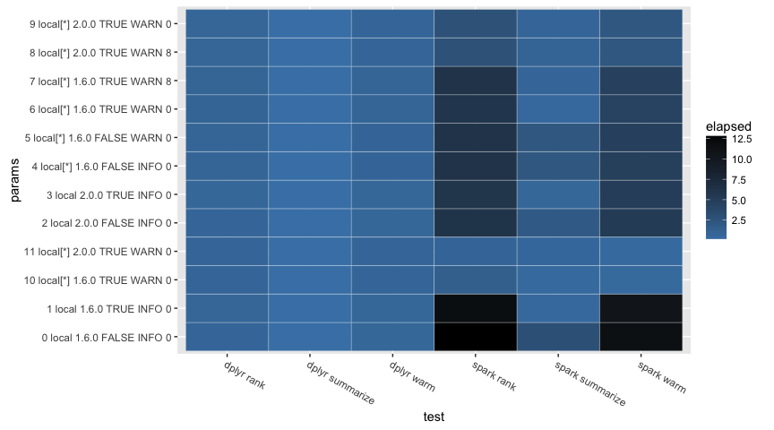
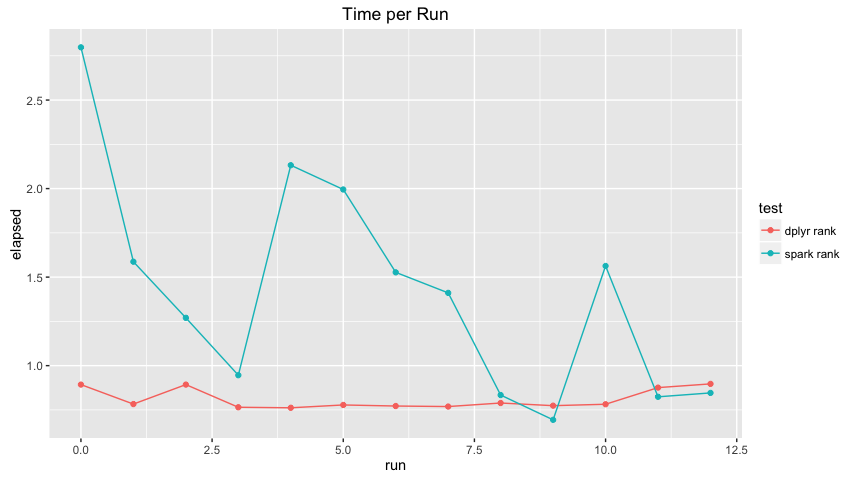
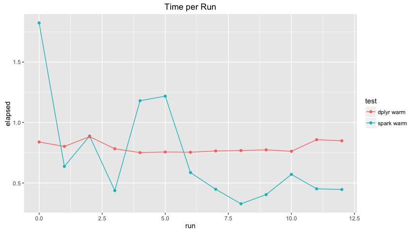

Performance: Dplyr Queries
================

Initialization
--------------

``` r
knitr::opts_chunk$set(warning = FALSE, cache = FALSE)
library(sparklyr)
library(dplyr)
```

    ## 
    ## Attaching package: 'dplyr'

    ## The following objects are masked from 'package:stats':
    ## 
    ##     filter, lag

    ## The following objects are masked from 'package:base':
    ## 
    ##     intersect, setdiff, setequal, union

``` r
library(reshape2)
library(ggplot2)
```

``` r
summarize_delay <- function(source) {
  source %>%
    group_by(tailnum) %>%
    summarise(count = n(), dist = mean(distance), delay = mean(arr_delay)) %>%
    filter(count > 20, dist < 2000)
}

top_players <- function(source) {
  source %>%
    select(playerID, yearID, teamID, G, AB:H) %>%
    arrange(playerID, yearID, teamID) %>%
    group_by(playerID) %>%
    filter(min_rank(desc(H)) <= 2 & H > 0)
}

top_players_by_run <- function(source) {
  source %>%
    select(playerID, yearID, teamID, G, AB:H) %>%
    arrange(playerID, yearID, teamID) %>%
    group_by(playerID) %>%
    filter(min_rank(desc(R)) <= 2 & R > 0)
}
```

``` r
spark_perf_test <- function(params, tests) {
  resultsList <- lapply(params, function(param) {
    spark_install(version = param$version, reset = TRUE, logging = param$logging)
    
    config <- spark_config()
    
    if (!is.null(param$shuffle)) {
      config[["spark.sql.shuffle.partitions"]] <- if(param$shuffle) parallel::detectCores() else NULL
    }
    
    if (!is.null(param$codegen)) {
      config[["spark.sql.codegen.wholeStage"]] <- param$codegen
    }
    
    if (!is.null(param$cores)) {
      config[["sparklyr.cores.local"]] <- if (is.na(param$cores)) NULL else param$cores
    }
    
    sc <- spark_connect(master = param$master, version = param$version, config = config)
    
    copy_to(sc,
            nycflights13::flights,
            "flights",
            memory = param$cache,
            repartition = param$partitions)
    
    copy_to(sc,
            Lahman::Batting,
            "batting",
            memory = param$cache,
            repartition = param$partitions)
    
    sources <- list(
      flights = tbl(sc, "flights"),
      batting = tbl(sc, "batting")
    )
    
    testResults <- lapply(seq_along(tests), function(testNames, testNum) {
      test <-  tests[[testNum]]
      testName <- names(tests)[[testNum]]
      
      unname(c(
        lapply(param, function(e) if (is.null(e)) NA else e),
        list(
          test = testName,
          elapsed = system.time(test(db, sources) %>% collect)[["elapsed"]]
        )
      ))
    }, testNames = names(tests))
    
    spark_disconnect(sc)
    
    testResults
  })
  
  columnNames <- c(names(params[[1]]), list("test", "elapsed"))
  
  resultsDF <- do.call(rbind.data.frame, unlist(resultsList, recursive = FALSE))
  
  colnames(resultsDF) <- columnNames
  
  resultsDF
}
```

``` r
spark_perf_single_test <- function(
  runResults,
  master,
  cores,
  version,
  logging,
  cache,
  partitions,
  optimizeShuffleForCores,
  codegen) {
  
  run <- length(runResults)
  
  c(
    runResults,
    list(
      spark_perf_test(
        params = list(
          list(
            run = run,
            master = master,
            cores = cores,
            version = version,
            logging = logging,
            cache = cache,
            shuffle = optimizeShuffleForCores,
            codegen = codegen,
            partitions = partitions
          )
        ),
        tests = list(
          `spark` = function(db, sources) {
            sources$flights %>% summarize_delay %>% head
          },
          `dplyr` = function(db, sources) {
            nycflights13::flights %>% summarize_delay %>% head
          },
          `spark rank` = function(db, sources) {
            sources$batting %>% top_players %>% head
          },
          `dplyr rank` = function(db, sources) {
            Lahman::Batting %>% top_players %>% head
          },
          `spark warm` = function(db, sources) {
            sources$batting %>% top_players_by_run %>% head
          },
          `dplyr warm` = function(db, sources) {
            Lahman::Batting %>% top_players_by_run %>% head
          }
        )
      )
    )
  )
}
```

Results
-------

``` r
runResults <- list()

runResults <- spark_perf_single_test(runResults, "local", NA, "1.6.0", "INFO", FALSE, 0, FALSE, FALSE)
runResults <- spark_perf_single_test(runResults, "local", NA, "1.6.0", "INFO", TRUE, 0, FALSE, FALSE)
runResults <- spark_perf_single_test(runResults, "local", NA, "2.0.0", "INFO", FALSE, 0, FALSE, FALSE)
runResults <- spark_perf_single_test(runResults, "local", NA, "2.0.0", "INFO", TRUE, 0, FALSE, FALSE)
runResults <- spark_perf_single_test(runResults, "local", NULL, "1.6.0", "INFO", FALSE, 0, FALSE, FALSE)
runResults <- spark_perf_single_test(runResults, "local", NULL, "1.6.0", "WARN", FALSE, 0, FALSE, FALSE)
runResults <- spark_perf_single_test(runResults, "local", NULL, "1.6.0", "WARN", TRUE, 0, FALSE, FALSE)
runResults <- spark_perf_single_test(runResults, "local", NULL, "1.6.0", "WARN", TRUE, 8, FALSE, FALSE)
runResults <- spark_perf_single_test(runResults, "local", NULL, "2.0.0", "WARN", TRUE, 8, FALSE, FALSE)
runResults <- spark_perf_single_test(runResults, "local", NULL, "2.0.0", "WARN", TRUE, 0, FALSE, FALSE)
runResults <- spark_perf_single_test(runResults, "local", NULL, "1.6.0", "WARN", TRUE, 0, TRUE, FALSE)
runResults <- spark_perf_single_test(runResults, "local", NULL, "2.0.0", "WARN", TRUE, 0, TRUE, FALSE)
runResults <- spark_perf_single_test(runResults, "local", NULL, "2.0.0", "WARN", TRUE, 0, TRUE, TRUE)

results <- do.call("rbind", runResults)

results <- results %>% 
  mutate(params = paste(run, version, cores, cache, logging, partitions, shuffle))
```

``` r
results %>%
  filter(test == "spark" | test == "dplyr") %>%
  rename(part = partitions) %>%
  dcast(run + cores + version + logging + part + shuffle + codegen ~ test, value.var = "elapsed")
```

    ##    run cores version logging part shuffle codegen dplyr spark
    ## 1    0    NA   1.6.0    INFO    0   FALSE   FALSE 0.102 2.819
    ## 2    1    NA   1.6.0    INFO    0   FALSE   FALSE 0.089 0.417
    ## 3    2    NA   2.0.0    INFO    0   FALSE   FALSE 0.097 1.591
    ## 4    3    NA   2.0.0    INFO    0   FALSE   FALSE 0.089 0.703
    ## 5    4    NA   1.6.0    INFO    0   FALSE   FALSE 0.084 1.815
    ## 6    5    NA   1.6.0    WARN    0   FALSE   FALSE 0.081 1.719
    ## 7    6    NA   1.6.0    WARN    0   FALSE   FALSE 0.085 0.392
    ## 8    7    NA   1.6.0    WARN    8   FALSE   FALSE 0.088 0.511
    ## 9    8    NA   2.0.0    WARN    8   FALSE   FALSE 0.082 0.738
    ## 10   9    NA   2.0.0    WARN    0   FALSE   FALSE 0.082 0.843
    ## 11  10    NA   1.6.0    WARN    0    TRUE   FALSE 0.085 0.401
    ## 12  11    NA   2.0.0    WARN    0    TRUE   FALSE 0.088 0.901
    ## 13  12    NA   2.0.0    WARN    0    TRUE    TRUE 0.088 0.812

``` r
results %>%
  filter(test == "spark rank" | test == "dplyr rank") %>%
  rename(part = partitions) %>%
  dcast(run + cores + version + logging + part + shuffle ~ test, value.var = "elapsed")
```

    ##    run cores version logging part shuffle dplyr rank spark rank
    ## 1    0    NA   1.6.0    INFO    0   FALSE      0.893      2.798
    ## 2    1    NA   1.6.0    INFO    0   FALSE      0.783      1.587
    ## 3    2    NA   2.0.0    INFO    0   FALSE      0.893      1.270
    ## 4    3    NA   2.0.0    INFO    0   FALSE      0.765      0.946
    ## 5    4    NA   1.6.0    INFO    0   FALSE      0.762      2.132
    ## 6    5    NA   1.6.0    WARN    0   FALSE      0.778      1.995
    ## 7    6    NA   1.6.0    WARN    0   FALSE      0.772      1.527
    ## 8    7    NA   1.6.0    WARN    8   FALSE      0.769      1.411
    ## 9    8    NA   2.0.0    WARN    8   FALSE      0.789      0.834
    ## 10   9    NA   2.0.0    WARN    0   FALSE      0.774      0.694
    ## 11  10    NA   1.6.0    WARN    0    TRUE      0.782      1.563
    ## 12  11    NA   2.0.0    WARN    0    TRUE      0.876      0.824
    ## 13  12    NA   2.0.0    WARN    0    TRUE      0.897      0.846

``` r
results %>%
  filter(test == "spark warm" | test == "dplyr warm") %>%
  rename(part = partitions) %>%
  dcast(run + cores + version + logging + part + shuffle ~ test, value.var = "elapsed")
```

    ##    run cores version logging part shuffle dplyr warm spark warm
    ## 1    0    NA   1.6.0    INFO    0   FALSE      0.839      1.823
    ## 2    1    NA   1.6.0    INFO    0   FALSE      0.802      0.637
    ## 3    2    NA   2.0.0    INFO    0   FALSE      0.883      0.888
    ## 4    3    NA   2.0.0    INFO    0   FALSE      0.783      0.437
    ## 5    4    NA   1.6.0    INFO    0   FALSE      0.751      1.180
    ## 6    5    NA   1.6.0    WARN    0   FALSE      0.756      1.218
    ## 7    6    NA   1.6.0    WARN    0   FALSE      0.754      0.586
    ## 8    7    NA   1.6.0    WARN    8   FALSE      0.765      0.448
    ## 9    8    NA   2.0.0    WARN    8   FALSE      0.768      0.328
    ## 10   9    NA   2.0.0    WARN    0   FALSE      0.774      0.404
    ## 11  10    NA   1.6.0    WARN    0    TRUE      0.762      0.571
    ## 12  11    NA   2.0.0    WARN    0    TRUE      0.858      0.452
    ## 13  12    NA   2.0.0    WARN    0    TRUE      0.849      0.446

``` r
results %>%
  filter(test != "dplyr" | test != "spark") %>%
  ggplot(aes(test, params)) + 
    geom_tile(aes(fill = elapsed), colour = "white") +
    scale_fill_gradient(low = "steelblue", high = "black") +
    theme(axis.text.x=element_text(angle=330, hjust = 0))
```



``` r
results %>%
  filter(test == "dplyr" | test == "spark") %>%
  ggplot(aes(x=run, y=elapsed, group = test, color = test)) + 
    geom_line() + geom_point() +
    ggtitle("Time per Run")
```


``` r
results %>%
  filter(test == "dplyr rank" | test == "spark rank") %>%
  ggplot(aes(x=run, y=elapsed, group = test, color = test)) + 
    geom_line() + geom_point() +
    ggtitle("Time per Run")
```



``` r
results %>%
  filter(test == "dplyr warm" | test == "spark warm") %>%
  ggplot(aes(x=run, y=elapsed, group = test, color = test)) + 
    geom_line() + geom_point() +
    ggtitle("Time per Run")
```


