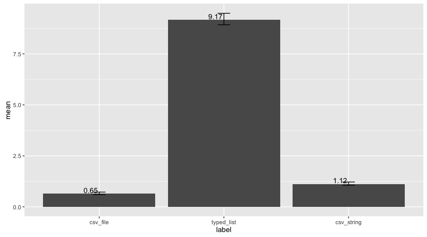

Spark Performance: Serializers
================

Setup
-----

``` r
sparklyr:::spark_install(version = "2.0.0-preview", reset = TRUE)
```

Initialization
--------------

``` r
library(sparklyr)
library(dplyr)
```

    ## 
    ## Attaching package: 'dplyr'

    ## The following objects are masked from 'package:stats':
    ## 
    ##     filter, lag

    ## The following objects are masked from 'package:base':
    ## 
    ##     intersect, setdiff, setequal, union

``` r
library(ggplot2)

config <- spark_config()
  config[["sparklyr.shell.driver-memory"]] <- "3G"
  config[["sparklyr.shell.executor-memory"]] <- "1G"

logResults <- function(label, test) {
  runTimes <- lapply(seq_len(3), function(idx) {
    runTime <- system.time({
      sum <- test()
    })
    
    as.data.frame(list(
      label = label,
      time = runTime[[3]],
      sum = sum))
  })
  
  runTimes <- do.call(rbind, runTimes)
  
  as.data.frame(list(
    label = label,
    min = min(runTimes$time),
    max = max(runTimes$time),
    mean = mean(runTimes$time)
  ))
}
```

Results
-------

``` r
sc <- spark_connect(master = "local",
                    version = "2.0.0-preview",
                    config = config)

serializers <- list(
  "csv_file",
  "typed_list",
  "csv_string"
)

flights <- nycflights13::flights
dataset <- head(flights[!is.na(flights$tailnum),], 10000)

# warm up
r <- copy_to(sc, dataset, paste0("dataset_", serializers[[1]]), overwrite = TRUE, serializer = serializers[[1]])
r <- copy_to(sc, dataset, paste0("dataset_", serializers[[2]]), overwrite = TRUE, serializer = serializers[[2]])
r <- copy_to(sc, dataset, paste0("dataset_", serializers[[3]]), overwrite = TRUE, serializer = serializers[[3]])

allRuns <- lapply(
  serializers,
  function(e) {
    results <- logResults(e, function() {
      r <- copy_to(sc, dataset, paste0("dataset_", e), overwrite = TRUE, serializer = e)
    })
      
    colnames(results) <- c("label", "min", "max", "mean")
    results
  })

spark_disconnect(sc)

results <- do.call("rbind", allRuns)
```

### Results chart

``` r
results %>% 
  ggplot(aes(label, mean)) +
  geom_bar(stat = "identity") +
  geom_text(aes(label = round(mean, 2)), vjust = -0.2, hjust = 1.1) +
  geom_errorbar(aes(ymin = min, ymax = max), width = 0.1)
```



### Results table

``` r
results
```

    ##        label   min   max      mean
    ## 1   csv_file 0.600 0.722 0.6466667
    ## 2 typed_list 8.928 9.493 9.1686667
    ## 3 csv_string 1.061 1.218 1.1170000
