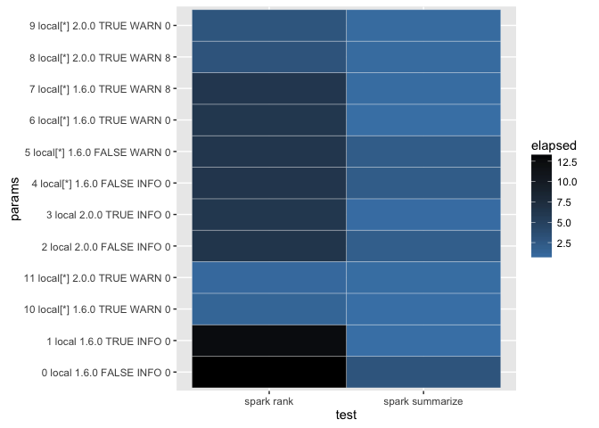

Performance Benchmark
================

Initialization
--------------

``` r
knitr::opts_chunk$set(warning = FALSE, cache = FALSE)
library(spark)
library(dplyr)
```

    ## 
    ## Attaching package: 'dplyr'

    ## The following objects are masked from 'package:stats':
    ## 
    ##     filter, lag

    ## The following objects are masked from 'package:base':
    ## 
    ##     intersect, setdiff, setequal, union

``` r
library(reshape2)
library(ggplot2)
```

    ## Warning: package 'ggplot2' was built under R version 3.2.4

``` r
summarize_delay <- function(source) {
  source %>%
    group_by(tailnum) %>%
    summarise(count = n(), dist = mean(distance), delay = mean(arr_delay)) %>%
    filter(count > 20, dist < 2000)
}

top_players <- function(source) {
  source %>%
    select(playerID, yearID, teamID, G, AB:H) %>%
    arrange(playerID, yearID, teamID) %>%
    group_by(playerID) %>%
    filter(min_rank(desc(H)) <= 2 & H > 0)
}
```

``` r
spark_perf_test <- function(params, tests) {
  resultsList <- lapply(params, function(param) {
    spark_install(version = param$version, reset = TRUE, logging = param$logging)
    
    sc <- spark_connect(param$master, param$version)
    db <- src_spark(sc)
    
    copy_to(db,
            nycflights13::flights,
            "flights",
            cache = param$cache,
            repartition = param$partitions)
    
    copy_to(db,
            Lahman::Batting,
            "batting",
            cache = param$cache,
            repartition = param$partitions)
    
    testResults <- lapply(seq_along(tests), function(testNames, testNum) {
      test <-  tests[[testNum]]
      testName <- names(tests)[[testNum]]
      
      unname(c(
        param,
        list(
          test = testName,
          elapsed = system.time(test(db))[["elapsed"]]
        )
      ))
    }, testNames = names(tests))
    
    spark_disconnect(sc)
    
    testResults
  })
  
  columnNames <- c(names(params[[1]]), list("test", "elapsed"))
  
  resultsDF <- do.call(rbind.data.frame, unlist(resultsList, recursive = FALSE))
  colnames(resultsDF) <- columnNames
  
  resultsDF
}
```

``` r
spark_perf_single_test <- function(runResults, master, version, logging, cache, partitions) {
  run <- length(runResults)
  
  c(
    runResults,
    list(
      spark_perf_test(
        params = list(
          list(
            run = run,
            master = master,
            version = version,
            logging = logging,
            cache = cache,
            partitions = partitions
          )
        ),
        tests = list(
          `spark summarize` = function(db) {
            tbl(db, "flights") %>% summarize_delay %>% head
          },
          `dplyr summarize` = function(db) {
            nycflights13::flights %>% summarize_delay %>% head
          },
          `spark rank` = function(db) {
            tbl(db, "batting") %>% top_players %>% head
          },
          `dplyr rank` = function(db) {
            Lahman::Batting %>% top_players %>% head
          }
        )
      )
    )
  )
}
```

Results
-------

``` r
runResults <- list()

runResults <- spark_perf_single_test(runResults, "local", "1.6.0", "INFO", FALSE, 0)
runResults <- spark_perf_single_test(runResults, "local", "1.6.0", "INFO", TRUE, 0)
runResults <- spark_perf_single_test(runResults, "local", "2.0.0", "INFO", FALSE, 0)
runResults <- spark_perf_single_test(runResults, "local", "2.0.0", "INFO", TRUE, 0)
runResults <- spark_perf_single_test(runResults, "local[*]", "1.6.0", "INFO", FALSE, 0)
runResults <- spark_perf_single_test(runResults, "local[*]", "1.6.0", "WARN", FALSE, 0)
runResults <- spark_perf_single_test(runResults, "local[*]", "1.6.0", "WARN", TRUE, 0)
runResults <- spark_perf_single_test(runResults, "local[*]", "1.6.0", "WARN", TRUE, 8)
runResults <- spark_perf_single_test(runResults, "local[*]", "2.0.0", "WARN", TRUE, 8)
runResults <- spark_perf_single_test(runResults, "local[*]", "2.0.0", "WARN", TRUE, 0)

results <- do.call("rbind", runResults)

results <- results %>% 
  mutate(params = paste(run, master, version, cache, logging, partitions))
```

``` r
results %>%
  filter(test == "spark summarize" | test == "dplyr summarize") %>%
  dcast(params ~ test, value.var = "elapsed")
```

    ##                           params dplyr summarize spark summarize
    ## 1     0 local 1.6.0 FALSE INFO 0           0.091           4.544
    ## 2      1 local 1.6.0 TRUE INFO 0           0.086           0.614
    ## 3     2 local 2.0.0 FALSE INFO 0           0.093           4.149
    ## 4      3 local 2.0.0 TRUE INFO 0           0.093           0.675
    ## 5  4 local[*] 1.6.0 FALSE INFO 0           0.099           3.379
    ## 6  5 local[*] 1.6.0 FALSE WARN 0           0.086           3.239
    ## 7   6 local[*] 1.6.0 TRUE WARN 0           0.089           0.690
    ## 8   7 local[*] 1.6.0 TRUE WARN 8           0.090           0.785
    ## 9   8 local[*] 2.0.0 TRUE WARN 8           0.090           0.777
    ## 10  9 local[*] 2.0.0 TRUE WARN 0           0.088           0.697

``` r
results %>%
  filter(test == "spark rank" | test == "dplyr rank") %>%
  dcast(params ~ test, value.var = "elapsed")
```

    ##                           params dplyr rank spark rank
    ## 1     0 local 1.6.0 FALSE INFO 0      0.873     13.847
    ## 2      1 local 1.6.0 TRUE INFO 0      0.791     12.674
    ## 3     2 local 2.0.0 FALSE INFO 0      0.833     13.626
    ## 4      3 local 2.0.0 TRUE INFO 0      0.883     12.961
    ## 5  4 local[*] 1.6.0 FALSE INFO 0      0.901      6.395
    ## 6  5 local[*] 1.6.0 FALSE WARN 0      0.935      6.734
    ## 7   6 local[*] 1.6.0 TRUE WARN 0      0.979      6.154
    ## 8   7 local[*] 1.6.0 TRUE WARN 8      0.932      6.277
    ## 9   8 local[*] 2.0.0 TRUE WARN 8      0.927      6.577
    ## 10  9 local[*] 2.0.0 TRUE WARN 0      0.974      5.720

``` r
results %>%
  filter(test == "spark rank" | test == "spark summarize") %>%
  ggplot(aes(test, params)) + 
    geom_tile(aes(fill = elapsed), colour = "white") +
    scale_fill_gradient(low = "steelblue", high = "black")
```



``` r
results %>%
  ggplot(aes(x=run, y=elapsed, group = test, color = test)) + 
    geom_line() + geom_point() +
    ggtitle("Time per Run")
```


