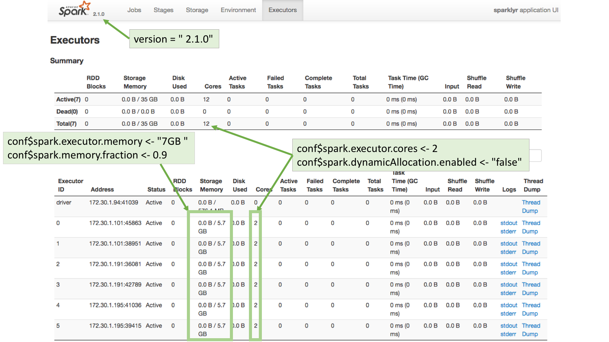

## Customizing connections

A connection to Spark can be customized by setting the values of certain Spark properties.  In `sparklyr`, Spark properties can be set by using the `config` argument in the `spark_connect()` function.    

By default, `spark_connect()` uses `spark_config()` as the default configuration.  But that can be customized as shown in the example code below. Because of the unending number of possible combinations, `spark_config()` contains only a basic configuration, so it will be very likely that additional settings will be needed to properly connect to the cluster.

```r
conf <- spark_config()   # Load variable with spark_config()

conf$spark.executor.memory <- "16G" # Use `$` to add or set values

sc <- spark_connect(master = "yarn-client", 
                    config = conf)  # Pass the conf variable 
```

### Spark definitions

It may be useful to provide some simple definitions for the Spark nomenclature: 

- **Node:** A server

- **Worker Node:** A server that is part of the cluster and are available to run Spark jobs

- **Master Node:** The server that coordinates the Worker nodes.

- **Executor:** A sort of virtual machine inside a node.  **One Node can have multiple Executors**.

- **Driver Node:** The Node that initiates the Spark session.  Typically, this will be the server where `sparklyr` is located.  

- **Driver (Executor):** The Driver Node will also show up in the Executor list.  

### Useful concepts

- **Spark configuration properties passed by R are just requests** - In most cases, the cluster has the final say regarding the resources apportioned to a given Spark session. 

- **The cluster overrides 'silently'** -  Many times, no errors are returned when more resources than allowed are requested, or if an attempt is made to change a setting fixed by the cluster. 

## YARN cluster

### Background

Using Spark and R inside a Hadoop based *Data Lake* is becoming a common practice at companies. Currently, *there is no good way to manage user connections to the Spark service centrally*. There are some caps and settings that can be applied, but in most cases there are configurations that the R user will need to customize.  

The [Running on YARN](https://spark.apache.org/docs/latest/running-on-yarn.html) page in Spark's official website is the best place to start for configuration settings reference, please bookmark it.  Cluster administrators and users can benefit from this document.  If Spark is new to the company, the [YARN tunning](https://blog.cloudera.com/blog/2015/03/how-to-tune-your-apache-spark-jobs-part-2/) article, courtesy of Cloudera, does a great job at explaining how the Spark/YARN architecture works. 

### Recommended properties

The following are the recommended Spark properties to set when connecting via R:

- **spark.executor.memory** - The maximum possible is managed by the YARN cluster. See the [Executor Memory Error](#yarn-executor)

- **spark.executor.cores** - Number of cores assigned per Executor.

- **spark.executor.instances** - Number of executors to start. This property is acknowledged by the cluster if *spark.dynamicAllocation.enabled* is set to "false".

- **spark.dynamicAllocation.enabled** -  Overrides the mechanism that Spark provides to dynamically adjust resources.  Disabling it provides more control over the number of the Executors that can be started, which in turn impact the amount of storage available for the session. For more information, please see the [Dynamic Resource Allocation](https://spark.apache.org/docs/latest/job-scheduling.html#dynamic-resource-allocation) page in the official Spark website.


### Connection example


```r
conf <- spark_config()

conf$spark.executor.memory <- "300M"
conf$spark.executor.cores <- 2
conf$spark.executor.instances <- 3
conf$spark.dynamicAllocation.enabled <- "false"

sc <- spark_connect(master = "yarn-client", 
                    spark_home = "/usr/lib/spark/",
                    version = "1.6.0",
                    config = conf)
```

#### Executors page 

To see how the requested configuration affected the Spark connection, go to the **Executors** page in the Spark Web UI. Typically, the Spark Web UI can be found using the exact same URL used for RStudio but on port 4040.

Notice that 155.3MB per executor are assigned instead of the 300MB requested.  This is because the *spark.memory.fraction* has been fixed by the cluster, plus, there is fixed amount of memory designated for overhead.  


### Executor memory error {#yarn-executor}

Requesting more memory or CPUs for Executors than allowed will return an error. This is one of the exceptions to the cluster's 'silent' overrides.  It will return a message similar to this:
```
    Failed during initialize_connection: java.lang.IllegalArgumentException: Required executor memory (16384+1638 MB) is above the max threshold (8192 MB) of this cluster! Please check the values of 'yarn.scheduler.maximum-allocation-mb' and/or 'yarn.nodemanager.resource.memory-mb'
```
**A cluster's administrator** is the only person who can make changes to the settings mentioned in the error. If the cluster is supported by a vendor, like Cloudera or Hortonworks, then the change can be made using the cluster's web UI.  Otherwise, changes to those settings are done directly in the *yarn-default.xml* file.

### Kerberos

There are two options to access a "kerberized" data lake:

- Use *kinit* to get and cache the ticket. After *kinit* is installed and configured. After *kinit* is setup, it can used in R via a `system()` call prior to connecting to the cluster: 
```r
system("echo '<password>' | kinit <username>")
```
For more information visit this site: [Apache - Authenticate with kinit](http://directory.apache.org/apacheds/kerberos-ug/4.1-authenticate-kinit.html)

- A preferred option may be to use the out-of-the-box integration with Kerberos that the commercial version of [RStudio Server](https://www.rstudio.com/products/rstudio-server-pro/) offers.

## Standalone mode

### Recommended properties

The following are the recommended Spark properties to set when connecting via R:

The default behavior in Standalone mode is to create one executor per worker. So in a 3 worker node cluster, there will be 3 executors setup.  The basic properties that can be set are:

- **spark.executor.memory** - The requested memory cannot exceed the actual RAM available.  

- **spark.memory.fraction** - The default is set to 60% of the requested memory per executor.  For more information, please see this [Memory Management Overview](https://spark.apache.org/docs/latest/tuning.html#memory-management-overview) page in the official Spark website.

- **spark.executor.cores** - The requested cores cannot be higher than the cores available in each worker.

#### Dynamic Allocation

If dynamic allocation is disabled, then Spark will attempt to assign all of the available cores evenly across the cluster.  The property used is **spark.dynamicAllocation.enabled**.

For example, the Standalone cluster used for this article has 3 worker nodes.  Each node has 14.7GB in RAM and 4 cores. This means that there are a total of 12 cores (3 workers with 4 cores) and 44.1GB in RAM (3 workers with 14.7GB in RAM each). 

If the `spark.executor.cores` property is set to 2, and dynamic allocation is disabled, then Spark will spawn 6 executors.  The `spark.executor.memory` property should be set to a level that when the value is multiplied by 6 (number of executors) it will not be over total available RAM.  In this case, the value can be safely set to 7GB so that the total memory requested will be 42GB, which is under the available 44.1GB.


### Connection example


```r
conf <- spark_config()
conf$spark.executor.memory <- "7GB"
conf$spark.memory.fraction <- 0.9
conf$spark.executor.cores <- 2
conf$spark.dynamicAllocation.enabled <- "false"

sc <- spark_connect(master="spark://master-url:7077", 
              version = "2.1.0",
              config = conf,
              spark_home = "/home/ubuntu/spark-2.1.0-bin-hadoop2.7/")
```

#### Executors page 

To see how the requested configuration affected the Spark connection, go to the **Executors** page in the Spark Web UI. Typically, the Spark Web UI can be found using the exact same URL used for RStudio but on port 4040:



## Local mode

### Recommended properties

The following are the recommended Spark properties to set when connecting via R:

- **sparklyr.cores.local** - It defaults to using all of the available cores. Not a necessary property to set, unless there's a reason to use less cores than available for a given Spark session.

- **sparklyr.shell.driver-memory** - The limit is the amount of RAM available in the computer minus what would be needed for OS operations.  

- **spark.memory.fraction** - The default is set to 60% of the requested memory per executor.  For more information, please see this [Memory Management Overview](https://spark.apache.org/docs/latest/tuning.html#memory-management-overview) page in the official Spark website.

### Connection example

```r
conf$`sparklyr.cores.local` <- 4
conf$`sparklyr.shell.driver-memory` <- "16G"
conf$spark.memory.fraction <- 0.9

sc <- spark_connect(master = "local", 
                    version = "2.1.0",
                    config = conf)
```

#### Executors page 

To see how the requested configuration affected the Spark connection, go to the **Executors** page in the Spark Web UI available in http://localhost:4040/storage/


