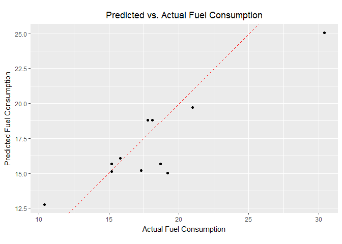

Spark Machine Learning Library (MLlib)
================

Overview
--------

**sparklyr** provides bindings to Spark's distributed [machine learning](https://spark.apache.org/docs/latest/mllib-guide.html) library. In particular, sparklyr allows you to access the machine learning routines provided by the [spark.ml](https://spark.apache.org/docs/latest/ml-guide) package. Together with sparklyr's [dplyr](/dplyr) interface, you can easily create and tune machine learning workflows on Spark, orchestrated entirely within R.

sparklyr provides three families of functions that you can use with Spark machine learning:

-   Machine learning algorithms for analyzing data (`ml_*`)
-   Feature transformers for manipulating individual features (`ft_*`)
-   Functions for manipulating Spark DataFrames (`sdf_*`)

An analytic workflow with sparklyr might be composed of the following stages. For an example see [Example Workflow](#example-workflow).

1.  Perform SQL queries through the sparklyr [dplyr](/dplyr) interface,
2.  Use the `sdf_*` and `ft_*` family of functions to generate new columns, or partition your data set,
3.  Choose an appropriate machine learning algorithm from the `ml_*` family of functions to model your data,
4.  Inspect the quality of your model fit, and use it to make predictions with new data.
5.  Collect the results for visualization and further analysis in R

Algorithms
----------

Spark's machine learning library can be accessed from sparklyr through the `ml_*` set of functions:

| Function                                                                                              | Description                   |
|-------------------------------------------------------------------------------------------------------|-------------------------------|
| [`ml_kmeans`](/reference/ml_kmeans)                                               | K-Means Clustering            |
| [`ml_linear_regression`](/reference/ml_linear_regression)                         | Linear Regression             |
| [`ml_logistic_regression`](/reference/ml_logistic_regression)                     | Logistic Regression           |
| [`ml_survival_regression`](/reference/ml_survival_regression)                     | Survival Regression           |
| [`ml_generalized_linear_regression`](/reference/ml_generalized_linear_regression) | Generalized Linear Regression |
| [`ml_decision_tree`](/reference/ml_decision_tree)                                 | Decision Trees                |
| [`ml_random_forest`](/reference/ml_random_forest)                                 | Random Forests                |
| [`ml_gradient_boosted_trees`](/reference/ml_gradient_boosted_trees)               | Gradient-Boosted Trees        |
| [`ml_pca`](/reference/ml_pca)                                                     | Principal Components Analysis |
| [`ml_naive_bayes`](/reference/ml_naive_bayes)                                     | Naive-Bayes                   |
| [`ml_multilayer_perceptron`](/reference/ml_multilayer_perceptron)                 | Multilayer Perceptron         |
| [`ml_lda`](/reference/ml_lda)                                                     | Latent Dirichlet Allocation   |
| [`ml_one_vs_rest`](/reference/ml_lda)                                             | One vs Rest                   |

### Formulas

The `ml_*` functions take the arguments `response` and `features`. But `features` can also be a formula with main effects (it currently does not accept interaction terms). The intercept term can be omitted by using `-1`.

``` r
# Equivalent statements
ml_linear_regression(z ~ -1 + x + y)
ml_linear_regression(intercept = FALSE, response = "z", features = c("x", "y"))
```

### Options

The Spark model output can be modified with the `ml_options` argument in the `ml_*` functions. The `ml_options` is an *experts only* interface for tweaking the model output. For example, `model.transform` can be used to mutate the Spark model object before the fit is performed.

Transformers
------------

A model is often fit not on a dataset as-is, but instead on some transformation of that dataset. Spark provides [feature transformers](http://spark.apache.org/docs/latest/ml-features), facilitating many common transformations of data within a Spark DataFrame, and sparklyr exposes these within the `ft_*` family of functions. These routines generally take one or more input columns, and generate a new output column formed as a transformation of those columns.

<table>
<colgroup>
<col width="38%" />
<col width="61%" />
</colgroup>
<thead>
<tr class="header">
<th>Function</th>
<th>Description</th>
</tr>
</thead>
<tbody>
<tr class="odd">
<td><a href="/reference/ft_binarizer"><code>ft_binarizer</code></a></td>
<td>Threshold numerical features to binary (0/1) feature</td>
</tr>
<tr class="even">
<td><a href="/reference/ft_bucketizer"><code>ft_bucketizer</code></a></td>
<td>Bucketizer transforms a column of continuous features to a column of feature buckets</td>
</tr>
<tr class="odd">
<td><a href="/reference/ft_discrete_cosine_transform"><code>ft_discrete_cosine_transform</code></a></td>
<td>Transforms a length NN real-valued sequence in the time domain into another length NN real-valued sequence in the frequency domain</td>
</tr>
<tr class="even">
<td><a href="/reference/ft_elementwise_product"><code>ft_elementwise_product</code></a></td>
<td>Multiplies each input vector by a provided weight vector, using element-wise multiplication.</td>
</tr>
<tr class="odd">
<td><a href="/reference/ft_index_to_string"><code>ft_index_to_string</code></a></td>
<td>Maps a column of label indices back to a column containing the original labels as strings</td>
</tr>
<tr class="even">
<td><a href="/reference/ft_quantile_discretizer"><code>ft_quantile_discretizer</code></a></td>
<td>Takes a column with continuous features and outputs a column with binned categorical features</td>
</tr>
<tr class="odd">
<td><a href="/reference/sql-transformer"><code>sql_transformer</code></a></td>
<td>Implements the transformations which are defined by a SQL statement</td>
</tr>
<tr class="even">
<td><a href="/reference/ft_string_indexer"><code>ft_string_indexer</code></a></td>
<td>Encodes a string column of labels to a column of label indices</td>
</tr>
<tr class="odd">
<td><a href="/reference/ft_vector_assembler"><code>ft_vector_assembler</code></a></td>
<td>Combines a given list of columns into a single vector column</td>
</tr>
</tbody>
</table>


Examples
--------

We will use the `iris` data set to examine a handful of learning algorithms and transformers. The iris data set measures attributes for 150 flowers in 3 different species of iris.

``` r
library(sparklyr)
```

    ## Warning: package 'sparklyr' was built under R version 3.4.3

``` r
library(ggplot2)
library(dplyr)
```

    ## 
    ## Attaching package: 'dplyr'

    ## The following objects are masked from 'package:stats':
    ## 
    ##     filter, lag

    ## The following objects are masked from 'package:base':
    ## 
    ##     intersect, setdiff, setequal, union

``` r
sc <- spark_connect(master = "local")
```

    ## * Using Spark: 2.1.0

``` r
iris_tbl <- copy_to(sc, iris, "iris", overwrite = TRUE)
iris_tbl
```

    ## # Source:   table<iris> [?? x 5]
    ## # Database: spark_connection
    ##    Sepal_Length Sepal_Width Petal_Length Petal_Width Species
    ##           <dbl>       <dbl>        <dbl>       <dbl>   <chr>
    ##  1          5.1         3.5          1.4         0.2  setosa
    ##  2          4.9         3.0          1.4         0.2  setosa
    ##  3          4.7         3.2          1.3         0.2  setosa
    ##  4          4.6         3.1          1.5         0.2  setosa
    ##  5          5.0         3.6          1.4         0.2  setosa
    ##  6          5.4         3.9          1.7         0.4  setosa
    ##  7          4.6         3.4          1.4         0.3  setosa
    ##  8          5.0         3.4          1.5         0.2  setosa
    ##  9          4.4         2.9          1.4         0.2  setosa
    ## 10          4.9         3.1          1.5         0.1  setosa
    ## # ... with more rows

### K-Means Clustering

Use Spark's [K-means clustering](http://spark.apache.org/docs/latest/ml-clustering.html#k-means) to partition a dataset into groups. K-means clustering partitions points into `k` groups, such that the sum of squares from points to the assigned cluster centers is minimized.

``` r
kmeans_model <- iris_tbl %>%
  select(Petal_Width, Petal_Length) %>%
  ml_kmeans(centers = 3)
```

    ## * No rows dropped by 'na.omit' call

``` r
# print our model fit
kmeans_model
```

    ## K-means clustering with 3 clusters
    ## 
    ## Cluster centers:
    ##   Petal_Width Petal_Length
    ## 1    1.359259     4.292593
    ## 2    0.246000     1.462000
    ## 3    2.047826     5.626087
    ## 
    ## Within Set Sum of Squared Errors =  31.41289

``` r
# predict the associated class
predicted <- sdf_predict(kmeans_model, iris_tbl) %>%
  collect
table(predicted$Species, predicted$prediction)
```

    ##             
    ##               0  1  2
    ##   setosa      0 50  0
    ##   versicolor 48  0  2
    ##   virginica   6  0 44

``` r
# plot cluster membership
sdf_predict(kmeans_model) %>%
  collect() %>%
  ggplot(aes(Petal_Length, Petal_Width)) +
  geom_point(aes(Petal_Width, Petal_Length, col = factor(prediction + 1)),
             size = 2, alpha = 0.5) + 
  geom_point(data = kmeans_model$centers, aes(Petal_Width, Petal_Length),
             col = scales::muted(c("red", "green", "blue")),
             pch = 'x', size = 12) +
  scale_color_discrete(name = "Predicted Cluster",
                       labels = paste("Cluster", 1:3)) +
  labs(
    x = "Petal Length",
    y = "Petal Width",
    title = "K-Means Clustering",
    subtitle = "Use Spark.ML to predict cluster membership with the iris dataset."
  )
```


### Linear Regression

Use Spark's [linear regression](http://spark.apache.org/docs/latest/ml-classification-regression.html#linear-regression) to model the linear relationship between a response variable and one or more explanatory variables.

``` r
lm_model <- iris_tbl %>%
  select(Petal_Width, Petal_Length) %>%
  ml_linear_regression(Petal_Length ~ Petal_Width)
```

    ## * No rows dropped by 'na.omit' call

``` r
iris_tbl %>%
  select(Petal_Width, Petal_Length) %>%
  collect %>%
  ggplot(aes(Petal_Length, Petal_Width)) +
    geom_point(aes(Petal_Width, Petal_Length), size = 2, alpha = 0.5) +
    geom_abline(aes(slope = coef(lm_model)[["Petal_Width"]],
                    intercept = coef(lm_model)[["(Intercept)"]]),
                color = "red") +
  labs(
    x = "Petal Width",
    y = "Petal Length",
    title = "Linear Regression: Petal Length ~ Petal Width",
    subtitle = "Use Spark.ML linear regression to predict petal length as a function of petal width."
  )
```


### Logistic Regression

Use Spark's [logistic regression](http://spark.apache.org/docs/latest/ml-classification-regression.html#logistic-regression) to perform logistic regression, modeling a binary outcome as a function of one or more explanatory variables.

``` r
# Prepare beaver dataset
beaver <- beaver2
beaver$activ <- factor(beaver$activ, labels = c("Non-Active", "Active"))
copy_to(sc, beaver, "beaver")
```

    ## # Source:   table<beaver> [?? x 4]
    ## # Database: spark_connection
    ##      day  time  temp      activ
    ##    <dbl> <dbl> <dbl>      <chr>
    ##  1   307   930 36.58 Non-Active
    ##  2   307   940 36.73 Non-Active
    ##  3   307   950 36.93 Non-Active
    ##  4   307  1000 37.15 Non-Active
    ##  5   307  1010 37.23 Non-Active
    ##  6   307  1020 37.24 Non-Active
    ##  7   307  1030 37.24 Non-Active
    ##  8   307  1040 36.90 Non-Active
    ##  9   307  1050 36.95 Non-Active
    ## 10   307  1100 36.89 Non-Active
    ## # ... with more rows

``` r
beaver_tbl <- tbl(sc, "beaver")

glm_model <- beaver_tbl %>%
  mutate(binary_response = as.numeric(activ == "Active")) %>%
  ml_logistic_regression(binary_response ~ temp)
```

    ## * No rows dropped by 'na.omit' call

``` r
glm_model
```

    ## Call: binary_response ~ temp
    ## 
    ## Coefficients:
    ## (Intercept)        temp 
    ##  -550.52331    14.69184

### PCA

Use Spark's [Principal Components Analysis (PCA)](https://spark.apache.org/docs/latest/mllib-dimensionality-reduction) to perform dimensionality reduction. PCA is a statistical method to find a rotation such that the first coordinate has the largest variance possible, and each succeeding coordinate in turn has the largest variance possible.

``` r
pca_model <- tbl(sc, "iris") %>%
  select(-Species) %>%
  ml_pca()
```

    ## * No rows dropped by 'na.omit' call

``` r
print(pca_model)
```

    ## Explained variance:
    ## 
    ##         PC1         PC2         PC3         PC4 
    ## 0.924618723 0.053066483 0.017102610 0.005212184 
    ## 
    ## Rotation:
    ##                      PC1         PC2         PC3        PC4
    ## Sepal_Length -0.36138659 -0.65658877  0.58202985  0.3154872
    ## Sepal_Width   0.08452251 -0.73016143 -0.59791083 -0.3197231
    ## Petal_Length -0.85667061  0.17337266 -0.07623608 -0.4798390
    ## Petal_Width  -0.35828920  0.07548102 -0.54583143  0.7536574

### Random Forest

Use Spark's [Random Forest](https://spark.apache.org/docs/latest/ml-classification-regression.html#random-forest-regression) to perform regression or multiclass classification.

``` r
rf_model <- iris_tbl %>%
  ml_random_forest(Species ~ Petal_Length + Petal_Width, type = "classification")
```

    ## * No rows dropped by 'na.omit' call

``` r
rf_predict <- sdf_predict(rf_model, iris_tbl) %>%
  ft_string_indexer("Species", "Species_idx") %>%
  collect

table(rf_predict$Species_idx, rf_predict$prediction)
```

    ##    
    ##      0  1  2
    ##   0 49  1  0
    ##   1  0 50  0
    ##   2  0  0 50

### SDF Partitioning

Split a Spark DataFrame into training, test datasets.

``` r
partitions <- tbl(sc, "iris") %>%
  sdf_partition(training = 0.75, test = 0.25, seed = 1099)

fit <- partitions$training %>%
  ml_linear_regression(Petal_Length ~ Petal_Width)
```

    ## * No rows dropped by 'na.omit' call

``` r
estimate_mse <- function(df){
  sdf_predict(fit, df) %>%
  mutate(resid = Petal_Length - prediction) %>%
  summarize(mse = mean(resid ^ 2)) %>%
  collect
}

sapply(partitions, estimate_mse)
```

    ## $training.mse
    ## [1] 0.2374596
    ## 
    ## $test.mse
    ## [1] 0.1898848

### FT String Indexing

Use `ft_string_indexer` and `ft_index_to_string` to convert a character column into a numeric column and back again.

``` r
ft_string2idx <- iris_tbl %>%
  ft_string_indexer("Species", "Species_idx") %>%
  ft_index_to_string("Species_idx", "Species_remap") %>%
  collect

table(ft_string2idx$Species, ft_string2idx$Species_remap)
```

    ##             
    ##              setosa versicolor virginica
    ##   setosa         50          0         0
    ##   versicolor      0         50         0
    ##   virginica       0          0        50

### SDF Mutate

[sdf\_mutate](/reference/sdf_mutate) is provided as a helper function, to allow you to use feature transformers. For example, the previous code snippet could have been written as:

``` r
ft_string2idx <- iris_tbl %>%
  sdf_mutate(Species_idx = ft_string_indexer(Species)) %>%
  sdf_mutate(Species_remap = ft_index_to_string(Species_idx)) %>%
  collect
  
ft_string2idx %>%
  select(Species, Species_idx, Species_remap) %>%
  distinct
```

    ## # A tibble: 3 x 3
    ##      Species Species_idx Species_remap
    ##        <chr>       <dbl>         <chr>
    ## 1     setosa           2        setosa
    ## 2 versicolor           0    versicolor
    ## 3  virginica           1     virginica

### Example Workflow

Let's walk through a simple example to demonstrate the use of Spark's machine learning algorithms within R. We'll use [ml\_linear\_regression](/reference/ml_linear_regression) to fit a linear regression model. Using the built-in `mtcars` dataset, we'll try to predict a car's fuel consumption (`mpg`) based on its weight (`wt`), and the number of cylinders the engine contains (`cyl`).

First, we will copy the `mtcars` dataset into Spark.

``` r
mtcars_tbl <- copy_to(sc, mtcars, "mtcars")
```

Transform the data with Spark SQL, feature transformers, and DataFrame functions.

1.  Use Spark SQL to remove all cars with horsepower less than 100
2.  Use Spark feature transformers to bucket cars into two groups based on cylinders
3.  Use Spark DataFrame functions to partition the data into test and training

Then fit a linear model using spark ML. Model MPG as a function of weight and cylinders.

``` r
# transform our data set, and then partition into 'training', 'test'
partitions <- mtcars_tbl %>%
  filter(hp >= 100) %>%
  sdf_mutate(cyl8 = ft_bucketizer(cyl, c(0,8,12))) %>%
  sdf_partition(training = 0.5, test = 0.5, seed = 888)

# fit a linear mdoel to the training dataset
fit <- partitions$training %>%
  ml_linear_regression(mpg ~ wt + cyl)
```

    ## * No rows dropped by 'na.omit' call

``` r
# summarize the model
summary(fit)
```

    ## Call: ml_linear_regression(., mpg ~ wt + cyl)
    ## 
    ## Deviance Residuals::
    ##     Min      1Q  Median      3Q     Max 
    ## -2.0947 -1.2747 -0.1129  1.0876  2.2185 
    ## 
    ## Coefficients:
    ##             Estimate Std. Error t value Pr(>|t|)    
    ## (Intercept) 33.79558    2.67240 12.6462 4.92e-07 ***
    ## wt          -1.59625    0.73729 -2.1650  0.05859 .  
    ## cyl         -1.58036    0.49670 -3.1817  0.01115 *  
    ## ---
    ## Signif. codes:  0 '***' 0.001 '**' 0.01 '*' 0.05 '.' 0.1 ' ' 1
    ## 
    ## R-Squared: 0.8267
    ## Root Mean Squared Error: 1.437

The `summary()` suggests that our model is a fairly good fit, and that both a cars weight, as well as the number of cylinders in its engine, will be powerful predictors of its average fuel consumption. (The model suggests that, on average, heavier cars consume more fuel.)

Let's use our Spark model fit to predict the average fuel consumption on our test data set, and compare the predicted response with the true measured fuel consumption. We'll build a simple ggplot2 plot that will allow us to inspect the quality of our predictions.

``` r
# Score the data
pred <- sdf_predict(fit, partitions$test) %>%
  collect

# Plot the predicted versus actual mpg
ggplot(pred, aes(x = mpg, y = prediction)) +
  geom_abline(lty = "dashed", col = "red") +
  geom_point() +
  theme(plot.title = element_text(hjust = 0.5)) +
  coord_fixed(ratio = 1) +
  labs(
    x = "Actual Fuel Consumption",
    y = "Predicted Fuel Consumption",
    title = "Predicted vs. Actual Fuel Consumption"
  )
```



Although simple, our model appears to do a fairly good job of predicting a car's average fuel consumption.

As you can see, we can easily and effectively combine feature transformers, machine learning algorithms, and Spark DataFrame functions into a complete analysis with Spark and R.
